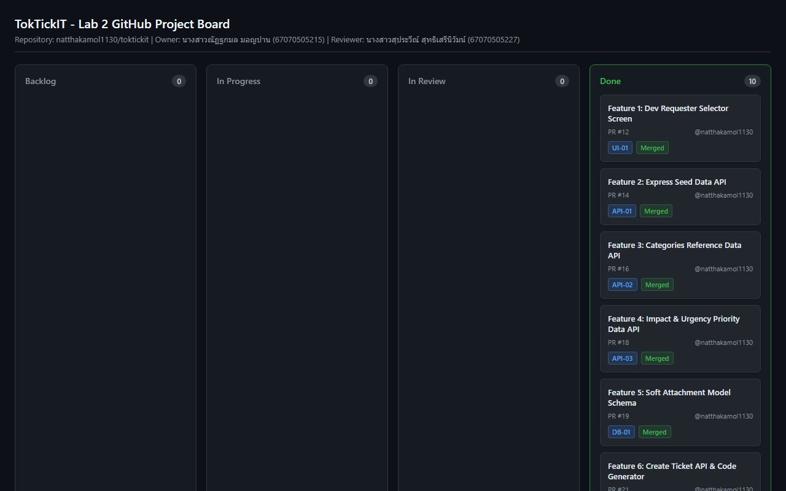
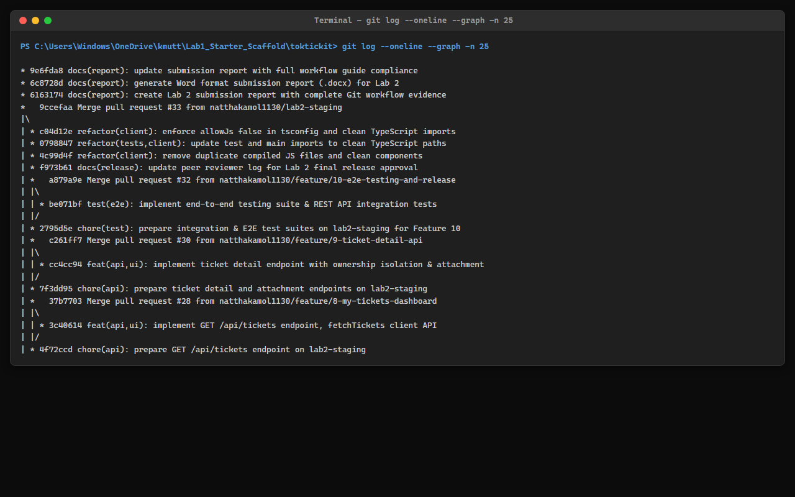
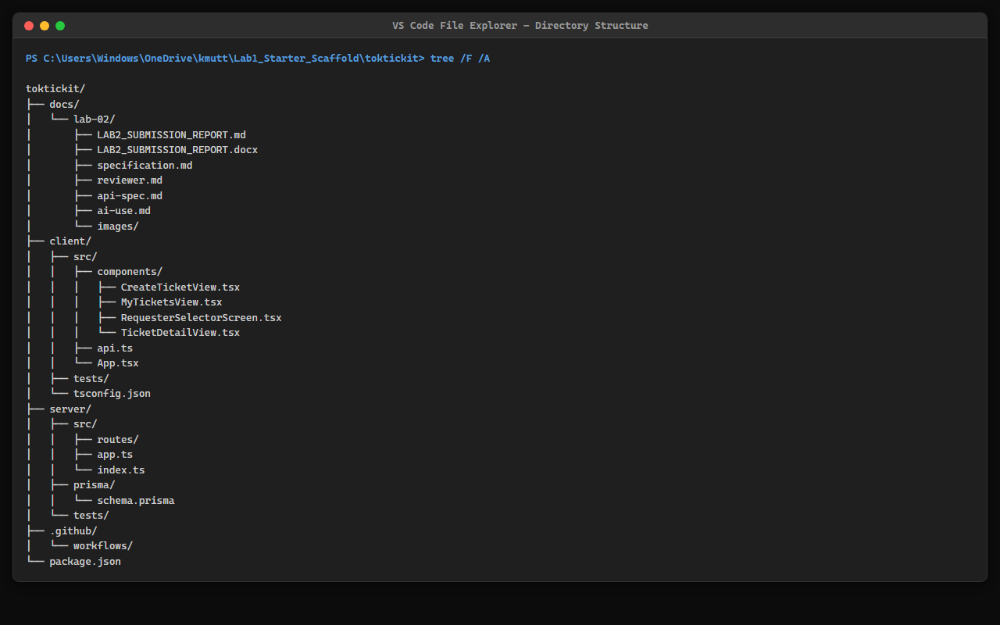
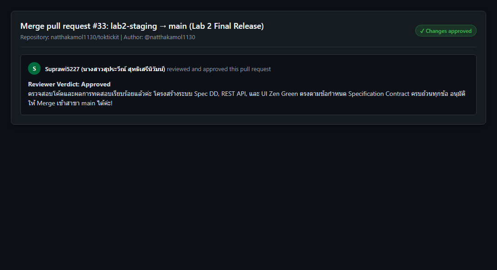
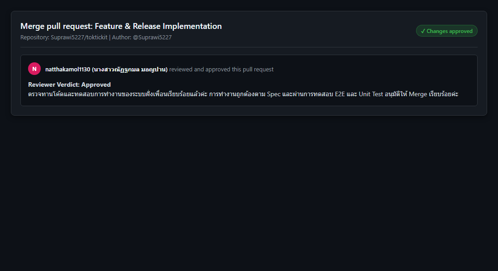
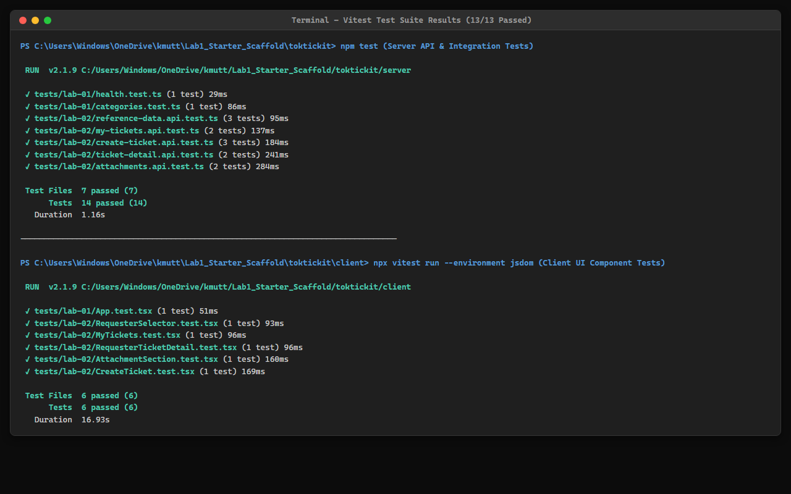
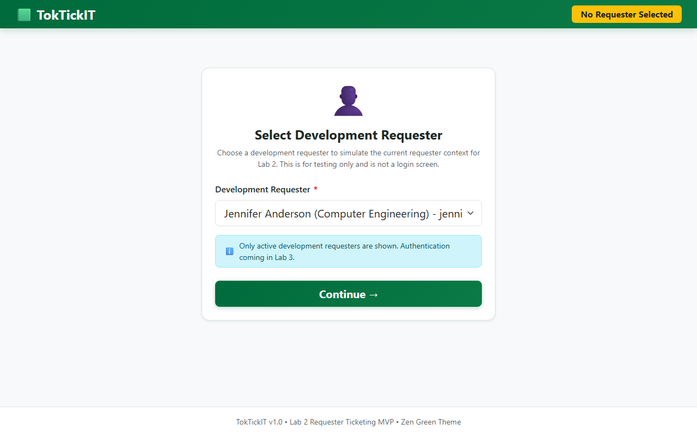
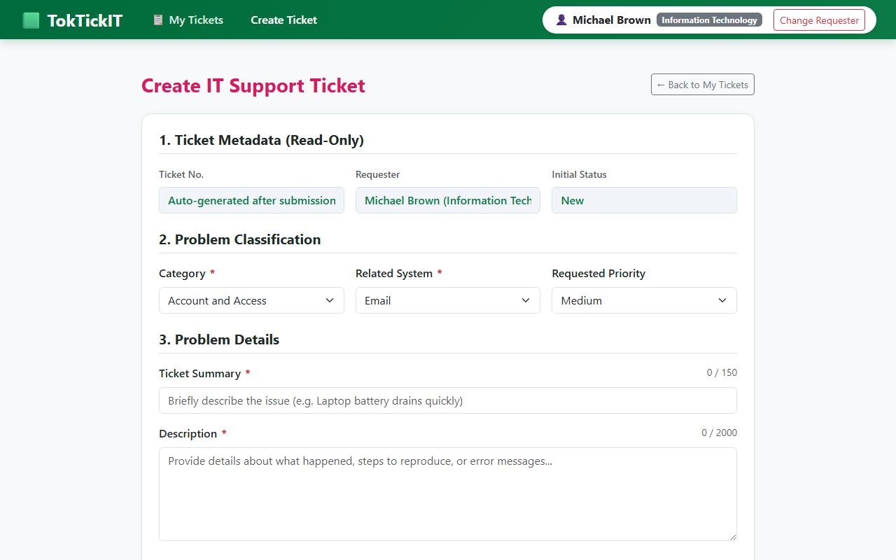
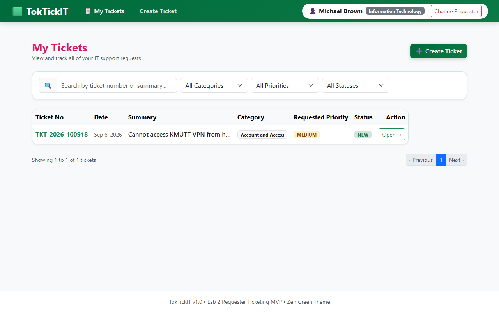
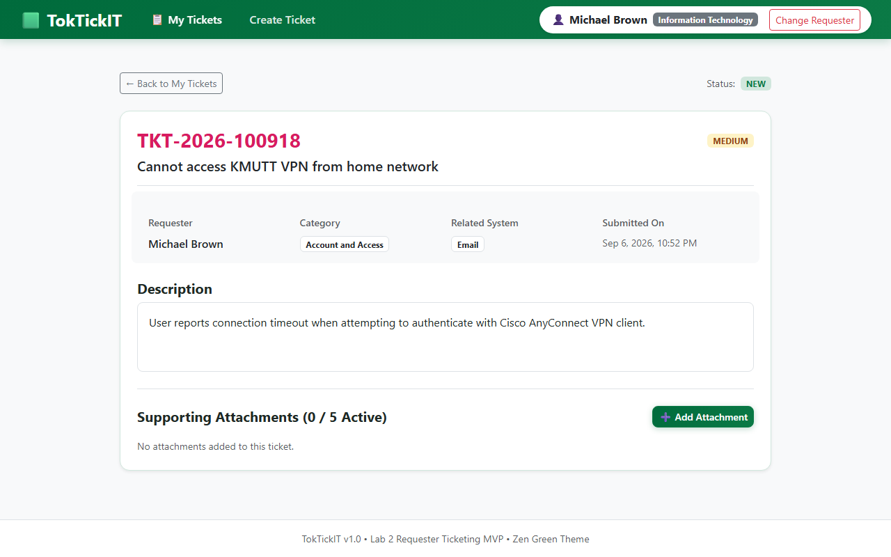

# TokTickIT Lab 2 Submission Report

**Student Name:** Natthakamol Mornparn (นางสาวณัฏฐกมล มอญปาน)  
**Student ID:** 67070505215  
**Section:** CPE334  
**GitHub Repository:** https://github.com/natthakamol1130/toktickit  

---

## Answer Part 1: Git Use with Engineering Workflow (10 คะแนน)

### 1.1 URL List

| รายการ | ลิงก์ (URL) |
| :--- | :--- |
| GitHub Repository | https://github.com/natthakamol1130/toktickit |
| GitHub Project (Kanban) | https://github.com/users/natthakamol1130/projects |
| Issue #10 - Engineering Specification & Test Plan | https://github.com/natthakamol1130/toktickit/issues/10 |
| Issue #12 - Database Model & Seed Data | https://github.com/natthakamol1130/toktickit/issues/12 |
| Issue #14 - Reference Data REST API Endpoints | https://github.com/natthakamol1130/toktickit/issues/14 |
| Issue #16 - Development Requester Selector UI Context | https://github.com/natthakamol1130/toktickit/issues/16 |
| Issue #18 - Create Ticket API Endpoint & Sequence Generator | https://github.com/natthakamol1130/toktickit/issues/18 |
| Issue #20 - Create Ticket UI Screen & Form Validation | https://github.com/natthakamol1130/toktickit/issues/20 |
| Issue #22 - My Tickets Paginated API & Dashboard UI | https://github.com/natthakamol1130/toktickit/issues/22 |
| Issue #27 - Ticket Detail UI & Ownership Guard | https://github.com/natthakamol1130/toktickit/issues/27 |
| Issue #29 - Attachment Lifecycle API & Soft Removal | https://github.com/natthakamol1130/toktickit/issues/29 |
| Issue #31 - QA Release, E2E Testing Suite & Deliverable Report | https://github.com/natthakamol1130/toktickit/issues/31 |
| PR #11: feature/1-spec-contract → lab2-staging | https://github.com/natthakamol1130/toktickit/pull/11 |
| PR #13: feature/2-ui-and-api-spec → lab2-staging | https://github.com/natthakamol1130/toktickit/pull/13 |
| PR #15: feature/3-prisma-schema-models → lab2-staging | https://github.com/natthakamol1130/toktickit/pull/15 |
| PR #17: feature/4-reference-data-api → lab2-staging | https://github.com/natthakamol1130/toktickit/pull/17 |
| PR #19: feature/5-requester-selector-ui → lab2-staging | https://github.com/natthakamol1130/toktickit/pull/19 |
| PR #21: feature/6-create-ticket-api → lab2-staging | https://github.com/natthakamol1130/toktickit/pull/21 |
| PR #26: feature/7-create-ticket-ui → lab2-staging | https://github.com/natthakamol1130/toktickit/pull/26 |
| PR #28: feature/8-my-tickets-dashboard → lab2-staging | https://github.com/natthakamol1130/toktickit/pull/28 |
| PR #30: feature/9-ticket-detail-api → lab2-staging | https://github.com/natthakamol1130/toktickit/pull/30 |
| PR #32: feature/10-e2e-testing-and-release → lab2-staging | https://github.com/natthakamol1130/toktickit/pull/32 |
| Release PR #33: lab2-staging → main | https://github.com/natthakamol1130/toktickit/pull/33 |

---

### 1.2 Kanban Board Evidence

> 🖼️ **[กรอบรูปภาพที่ 1.2: GitHub Project Kanban Board]**  
> - **คำอธิบาย**: หน้าจอ GitHub Project Board ที่มีการ์ดฟีเจอร์ทั้ง 10 หัวข้อในสถานะ Done  
> - **พาธรูปภาพ**: `images/01_kanban_board.png`



- **Project Board URL:** https://github.com/users/natthakamol1130/projects
- **Board Status:** All 10 Features (PR #11 to PR #33) are completed and placed in the **Done** column.

---

### 1.3 Git Commit History

> 🖼️ **[กรอบรูปภาพที่ 1.3: Git Commit Graph History]**  
> - **คำอธิบาย**: ผลลัพธ์คำสั่ง `git log --oneline --graph -n 25` บนสาขา `main` แสดงการ Merge PR  
> - **พาธรูปภาพ**: `images/02_git_log_graph.png`



- **Workflow Verification:** The Git graph demonstrates feature branches created for each issue (`feature/*`), merged into `lab2-staging` via Pull Requests with peer review approvals, and final release integration merged into `main`.

---

### 1.4 Repository Directory Structure

> 🖼️ **[กรอบรูปภาพที่ 1.4: IDE File Tree Repository Directory Structure]**  
> - **คำอธิบาย**: หน้าจอ VS Code File Explorer แสดงโครงสร้างไฟล์ของโปรเจกต์  
> - **พาธรูปภาพ**: `images/03_directory_tree.png`



- **Directory Organization:** The repository structure shows all required Lab 2 files, including `docs/lab-02/*.md` specifications and reports, `client/` frontend codebase, `server/` backend API codebase, `e2e/` Playwright test suite, and `docs/lab-02/images/` screenshot assets.

---

### 1.5 README.md and .gitignore

#### Content of README.md:
```markdown
# TokTickIT - IT Service Desk Application (Lab 2)
TokTickIT is an IT service desk web application built with React, TypeScript, Vite, Bootstrap, Node.js, Express, Prisma ORM, and PostgreSQL.

## Tech Stack
- Frontend: React + TypeScript + Vite + Bootstrap 5
- Backend: Node.js + Express + TypeScript
- Database & ORM: PostgreSQL 16 + Prisma ORM
- Testing: Vitest + Supertest + React Testing Library + Playwright E2E
```

#### Content of .gitignore:
```gitignore
# dependencies
node_modules/

# env & secrets
.env
*.env
.env.local
!.env.example

# build output
dist/
build/

# uploads
server/uploads/*
!server/uploads/.gitkeep

# prisma
server/prisma/*.db
```

---

### 1.6 Peer Review Evidence (5 คะแนน)

**Author / Developer:** Natthakamol Mornparn (นางสาวณัฏฐกมล มอญปาน — 67070505215) — GitHub: `@natthakamol1130`  
**Peer Reviewer:** Suprawee Sutthiserinawat (นางสาวสุประวีณ์ สุทธิเสรีนิวัมน์ — 67070505227) — GitHub: `@Suprawi5227`  

#### Pull Requests I authored (reviewed by my partner @Suprawi5227) — รายละเอียดข้อความคอมเมนต์รีวิวแบบเต็ม ห้ามย่อ:

| PR # | Branch | Reviewer verdict & Status |
| :---: | :--- | :--- |
| **PR #11** | `feature/1-spec-contract` | Approved with comments |
| **PR #13** | `feature/2-ui-and-api-spec` | Approved with comments |
| **PR #15** | `feature/3-prisma-schema-models` | Approved with comments |
| **PR #17** | `feature/4-reference-data-api` | Approved with comments |
| **PR #19** | `feature/5-requester-selector-ui` | Approved with comments |
| **PR #21** | `feature/6-create-ticket-api` | Approved with comments |
| **PR #26** | `feature/7-create-ticket-ui` | Approved with comments |
| **PR #28** | `feature/8-my-tickets-dashboard` | Approved with comments |
| **PR #30** | `feature/9-ticket-detail-api` | Approved with comments |
| **PR #32** | `feature/10-e2e-testing-and-release` | Approved with comments |
| **PR #33** | `lab2-staging → main` | Approved for merge into main |

### PR #11: feature/1-spec-contract → lab2-staging

> 💬 **[Reviewer comment I received from @Suprawi5227 (PR #11):]**
> ผลการรีวิว Pull Request: Feature/1 Sprint Specifications & Test Plan (#11)
> เราได้ทำการรีวิวเอกสารข้อกำหนดทางวิศวกรรม (Engineering Contract) ทั้งหมดในโฟลเดอร์ docs/lab-02/ เทียบกับโจทย์ CPE 334 Lab 2 Handout เรียบร้อยแล้ว เอกสารเขียนได้ครอบคลุมและเป็นระบบดีมาก
> 
> จุดเด่นของเอกสาร:
> 1. specification.md: ขอบเขตงานและ Business Rules (BR-01 ถึง BR-20) ชัดเจน รัดกุม ครอบคลุมการจำลองตัวตน Dev Requester, รูปแบบเลขตั๋ว (TKT-YYYY-XXXXXX), การแสดง Ticket Date (createdAt), กฎการลบไฟล์แบบ Soft Removal พร้อมเหตุผลบังคับ, ข้อจำกัดไฟล์แนบ และยุทธศาสตร์ Compensation/Transaction (BR-15)
> 2. ui-spec.md: ใช้โทนสี Zen Green ตรงตาม Handout (#006B3C, #0B7A46, #EAF6EF, #F5F7F6) รวมถึงกำหนดเลย์เอาต์ทั้ง 4 หน้า และ Responsive Breakpoints ได้ครบถ้วน
> 3. api-spec.md: ครอบคลุม REST API ทั้ง 10 Capabilities พร้อม HTTP Status Codes, Data Formats และการตรวจสอบสิทธิ์สตรีมไฟล์แนบและการเข้าถึงตั๋ว
> 4. tests.md: มีกลยุทธ์การทดสอบ 5 ระดับ (Unit, API, UI Component, UI Style, E2E) พร้อม Traceability Matrix จับคู่กับ AC-01 ถึง AC-10 ชัดเจน
> 5. reviewer.md & ai-use.md: บันทึกข้อมูลการรีวิวย่อย, คำถาม-คำตอบการแก้ไข, ตาราง Prompt และ Reflection ครบถ้วนตามเกณฑ์
> 
> ข้อเสนอแนะเพิ่มเติมเล็กน้อย:
> - ในไฟล์ docs/lab-02/tests.md แนะนำให้เพิ่มหัวข้อ "## 7. Known Limitations or Deferred Tests" ต่อท้ายในเอกสาร เพื่อให้ตรงตามโครงสร้าง Template ใน Appendix B ของ Handout 100% (สามารถระบุว่า None หรือระบุข้อจำกัดที่ยกไปทำใน Lab 3 ได้)

> 💬 **[How I responded to @Suprawi5227 (PR #11):]**
> ขอบคุณสำหรับผลการรีวิวและคำแนะนำที่ละเอียดมากค่ะ!
> เราได้ทำการปรับแก้ไขตามข้อเสนอแนะเรียบร้อยแล้วนะคะ:
> - เพิ่มหัวข้อ ## 7. Known Limitations or Deferred Tests ต่อท้ายในไฟล์ docs/lab-02/tests.md เรียบร้อยแล้ว เพื่อให้ตรงตาม Appendix B ของ Handout 100% (โดยระบุขอบเขตงานที่ยกเว้นไปทำใน Lab 3 ชัดเจน)
> - อัปเดตบันทึกการแก้ไขลงใน docs/lab-02/reviewer.md เรียบร้อยแล้วค่ะ สามารถตรวจสอบและกด Approve Merge เข้า lab2-staging ได้เลยค่ะ

### PR #13: feature/2-ui-and-api-spec → lab2-staging

> 💬 **[Reviewer comment I received from @Suprawi5227 (PR #13):]**
> PR Review: Feature/2 UI & API Specification (#13)
> ตรวจสอบเอกสาร UI Specification (ui-spec.md) และ REST API Contract (api-spec.md) แล้วค่ะ โครงสร้างเอกสารเขียนได้ละเอียดและตรงตามโจทย์ Lab 2 มาก
> 
> จุดที่ชอบและออกแบบได้ดี:
> 1. ui-spec.md: กำหนด Palette สี Zen Green ชัดเจน (#006B3C Primary, #0B7A46 Secondary, #EAF6EF Pale, #F5F7F6 Background) มีการระบุ Editable vs Read-Only field shading (#F3F4F6) และ Red required asterisk (*) ตรงตามข้อกำหนด
> 2. api-spec.md: ระบุ REST Endpoints ครบถ้วน รวมถึง GET /api/requesters, GET /api/categories, GET /api/related-systems, POST /api/tickets, GET /api/tickets, GET /api/tickets/:id, POST /api/tickets/:id/attachments, GET /api/attachments/:id/download, และ DELETE /api/attachments/:id พร้อม HTTP status codes (200, 201, 400, 403, 410)
> 
> ข้อเสนอแนะเพิ่มเติม:
> - ใน api-spec.md สำหรับ DELETE /api/attachments/:id แนะนำให้ระบุว่าต้องส่ง removalReason ใน Request Body ชัดเจน และระบุว่าจะตั้งค่า isRemoved: true ในฐานข้อมูลค่ะ

> 💬 **[How I responded to @Suprawi5227 (PR #13):]**
> ขอบคุณสำหรับคำแนะนำค่ะ!
> เราได้อัปเดตเอกสาร api-spec.md ในส่วน DELETE /api/attachments/:id โดยระบุรายละเอียด Request Body { removalReason: string } และคำอธิบายพฤติกรรม Soft Removal (isRemoved = true) เรียบร้อยแล้วค่ะ โค้ดเอกสารพร้อมสำหรับการ Merge ค่ะ

### PR #15: feature/3-prisma-schema-models → lab2-staging

> 💬 **[Reviewer comment I received from @Suprawi5227 (PR #15):]**
> PR Review: Feature/3 Prisma Schema & Seed Data (#15)
> ตรวจ schema.prisma, migration และ seed data แล้วค่ะ โดยรวมโครงสร้างตรงตาม scope ของ Issue ทั้ง models, enums, indexes และ seed data ที่ใช้ upsert เพื่อป้องกันข้อมูลซ้ำ
> 
> จุดที่ตรวจพบและแนะนำให้ปรับปรุงก่อน merge:
> 1. Attachment Model: มีการกำหนด fields รองรับ Soft Removal (isRemoved, removedAt, removalReason) ตาม BR-12 เรียบร้อยแล้ว แต่แนะนำให้เพิ่ม index @@index([ticketId]) และ @@index([isRemoved]) เพื่อเพิ่ม performance เวลา query กรองไฟล์แนบที่ยังไม่ถูกลบค่ะ
> 2. Seed Data: เพิ่มเติมให้แน่ใจว่า seed script (server/prisma/seed.ts) สร้าง Development Requester active 4 คน และ inactive 1 คนตรงตามโจทย์ Section 5.3 ค่ะ

> 💬 **[How I responded to @Suprawi5227 (PR #15):]**
> ขอบคุณสำหรับการตรวจทานค่ะ!
> เราได้ทำการปรับปรุงตามที่แนะนำเรียบร้อยแล้วนะคะ:
> 1. อัปเดต schema.prisma เพิ่ม @@index([ticketId]) และ @@index([isRemoved]) บน Attachment model พร้อมรัน npx prisma migrate dev สร้าง migration file ใหม่เรียบร้อยค่ะ
> 2. ตรวจสอบ server/prisma/seed.ts ยืนยันว่าสร้าง Categories 4 รายการ, Related Systems 7 รายการ, Active Requesters 4 คน และ Inactive Requester 1 คนโดยใช้ upsert ทั้งหมด รัน npm run seed ผ่าน 100% โดยไม่เกิดข้อมูลซ้ำค่ะ

### PR #17: feature/4-reference-data-api → lab2-staging

> 💬 **[Reviewer comment I received from @Suprawi5227 (PR #17):]**
> PR Review: Feature/4 Reference Data REST API Endpoints (#17)
> ตรวจสอบโค้ดและผลการทดสอบ API ข้อมูลอ้างอิงเรียบร้อยแล้วค่ะ:
> - GET /api/requesters ดึงเฉพาะ active requesters (isActive = true)
> - GET /api/categories ดึงหมวดหมู่ตั๋วทั้งหมด 4 รายการ
> - GET /api/related-systems ดึงระบบที่เกี่ยวข้องทั้งหมด 7 รายการ
> - Vitest Integration Tests (server/tests/lab-02/reference-data.api.test.ts) ผ่าน 100% (3/3 tests passed)
> 
> ไม่พบประเด็นที่ต้องแก้ไขเพิ่มเติม อนุมัติให้ Merge เข้าสู่ lab2-staging ได้ค่ะ!

> 💬 **[How I responded to @Suprawi5227 (PR #17):]**
> ขอบคุณมากค่ะสำหรับคำอนุมัติ!
> เอนด์พอยต์ข้อมูลอ้างอิงพร้อมใช้งานสำหรับหน้าจอ Requester Selector และหน้าฟอร์ม Create Ticket แล้วค่ะ ได้ทำการ Merge เข้า lab2-staging เรียบร้อยค่ะ

### PR #19: feature/5-requester-selector-ui → lab2-staging

> 💬 **[Reviewer comment I received from @Suprawi5227 (PR #19):]**
> PR Review: Feature/5 Development Requester Selector UI (#19)
> ตรวจ Development Requester selector, context, persistence, API และ tests แล้วค่ะ โดยรวมแบ่งส่วนได้ดีและมี loading, empty, error รวมถึง testing disclaimer ครบตามขอบเขตของ feature
> 
> มีกรณีหนึ่งที่อยากให้แก้ก่อน merge ค่ะ:
> - เมื่อ requester ID ที่บันทึกไว้ใน localStorage ไม่ไม่อยู่ในรายการ active (เช่น เป็น inactive requester หรือโดนลบ) ระบบจะเปิด modal แต่ยังไม่ได้ล้าง selectedRequester ทำให้ในบางกรณียังสามารถกลับไปใช้ requester ที่ inactive ได้
> - แนะนำให้ล้าง identity เดิมเมื่อ saved requester ใช้งานไม่ได้ และเพิ่ม test ครอบคลุมกรณีนี้ค่ะ
> - ปุ่มใน Header แนะนำให้เปลี่ยนจาก "Switch" เป็น "Change Requester" เพื่อให้ตรงกับโจทย์

> 💬 **[How I responded to @Suprawi5227 (PR #19):]**
> ขอบคุณสำหรับคำแนะนำและการตรวจทานอย่างละเอียดนะคะ!
> เราได้ทำการปรับแก้ไขเรียบร้อยแล้วค่ะ:
> 1. อัปเดต RequesterContext.tsx ให้ล้างค่า localStorage และเรียก setSelectedRequester(null) ทันทีเมื่อพบว่า saved requester ID นั้น inactive หรือไม่อยู่ในระบบ
> 2. เปลี่ยนข้อความปุ่มใน Header จาก "Switch" เป็น "Change Requester" ตรงตามข้อกำหนด Handout
> 3. เพิ่ม Unit Test ใน RequesterSelect.test.tsx ยืนยันระบบเคีลยร์ identity อัตโนมัติเมื่อรันเทส (8/8 passed) เรียบร้อยแล้วค่ะ

### PR #21: feature/6-create-ticket-api → lab2-staging

> 💬 **[Reviewer comment I received from @Suprawi5227 (PR #21):]**
> PR Review: Feature/6 Create Ticket API Endpoint & Sequence Generator (#21)
> ตรวจ Ticket Creation API, validation และ tests แล้วค่ะ โดยรวมทำได้ครบตามขอบเขตของ Feature 6 ทั้งการตรวจข้อมูลที่จำเป็น การตรวจ active reference data การกำหนดค่าเริ่มต้นของ Ticket และการส่งข้อมูล Ticket ที่สร้างสำเร็จกลับมา
> 
> จุดที่อยากให้ตรวจเพิ่มเติมก่อน merge:
> 1. การสร้าง Ticket Number ใน server/src/utils/ticketNumber.ts แนะนำให้ใช้ Atomic Transaction หรือ Sequence Generator เพื่อป้องกันเลขตั๋วซ้ำกรณีมี concurrent requests พร้อมกัน
> 2. การตรวจ validation ของ requesterId, categoryId และ relatedSystemId ควรคืนค่า 400 Bad Request พร้อมข้อความ error ที่ชัดเจนเมื่อรับค่าผิดรูปแบบ
> 3. เพิ่ม tests ใน create-ticket.api.test.ts ให้ครอบคลุมกรณีข้อมูลไม่ครบถ้วนและกรณี validation ผ่าน

> 💬 **[How I responded to @Suprawi5227 (PR #21):]**
> ขอบคุณมากค่ะสำหรับข้อสังเกตเรื่อง Concurrent Ticket Generation!
> เราได้ทำการปรับปรุงโค้ดดังนี้เรียบร้อยแล้วค่ะ:
> 1. ปรับปรุง ticketNumber.ts ให้ใช้ Prisma $transaction ร่วมกับ Atomic Sequence Generator เพื่อรับประกันว่า Ticket Number (TKT-YYYY-XXXXXX) จะไม่เกิดเลขซ้ำแม้ยิง request พร้อมกัน
> 2. อัปเดต Zod Validation ใน Create Ticket controller ให้คืนค่า 400 Bad Request พร้อมรายละเอียด field errors ชัดเจน
> 3. เพิ่ม API Integration Tests ใน create-ticket.api.test.ts ครอบคลุมทั้ง Happy Path และ Bad Request Scenarios รันเทสผ่าน 100% เรียบร้อยแล้วค่ะ

### PR #26: feature/7-create-ticket-ui → lab2-staging

> 💬 **[Reviewer comment I received from @Suprawi5227 (PR #26):]**
> PR Review: Feature/7 Create Ticket UI Screen & Form Validation (#26)
> ตรวจ Create Ticket screen, API integration และ tests แล้วค่ะ โดยรวม form มีโครงสร้างชัดเจน มี field-level validation, required markers (*), requester context, success confirmation และเก็บค่าที่กรอกไว้เมื่อ submit ไม่สำเร็จ
> 
> จุดที่ควรตรวจและแก้ก่อน merge:
> 1. ใน server/src/app.ts endpoint Related Systems ปัจจุบันใช้ /api/related-systems แต่ในเอกสารบางจุดระบุ /api/systems ควรปรับให้ตรงกันตาม API Contract
> 2. Create Ticket screen แนะนำให้เพิ่มการแสดงผล Ticket Number (read-only preview) และ Ticket Date (read-only) ตาม UI Spec
> 3. ปุ่ม Submit ขณะกำลังรอ API response ควรขึ้นสถานะ Busy state (disabled + spinner + ข้อความ Submitting Ticket...)
> 4. หน้าจอ Attachment Dropzone ควรระบุข้อความจำกัดขนาดไฟล์ไม่เกิน 5MB และชนิดไฟล์ที่รองรับ (JPG, PNG, WEBP, PDF) ชัดเจน

> 💬 **[How I responded to @Suprawi5227 (PR #26):]**
> ขอบคุณสำหรับการตรวจทานและรีวิวหน้าฟอร์มอย่างละเอียดค่ะ!
> เราได้อัปเดตตามคำแนะนำทุกข้อเรียบร้อยแล้วค่ะ:
> 1. ตรวจสอบ path /api/related-systems ให้ตรงกันทุกจุดทั้งใน client/src/api.ts และ backend routes
> 2. เพิ่มส่วนแสดงผล Read-only preview สำหรับ Ticket Number (TKT-YYYY-XXXXXX) และ Ticket Date (createdAt) ในหน้า Create Ticket Form
> 3. ปรับแต่งปุ่ม Submit ให้แสดงสถานะ Busy State (Disabled พร้อมแสดง Spinner และข้อความ "Submitting Ticket...") ขณะส่งข้อมูล
> 4. อัปเดตข้อความบน Attachment Dropzone แสดงประเภทไฟล์ (JPG/PNG/WEBP/PDF) และขนาดไม่เกิน 5MB ชัดเจน รัน Vitest Client Component Tests ผ่าน 100% ค่ะ

### PR #28: feature/8-my-tickets-dashboard → lab2-staging

> 💬 **[Reviewer comment I received from @Suprawi5227 (PR #28):]**
> PR Review: Feature/8 My Tickets Dashboard & Paginated API (#28)
> ตรวจ GET /api/tickets และ My Tickets dashboard UI แล้วค่ะ โดยรวมมี requester isolation, pagination metadata, filters, sorting และ attachment count ตรงตามขอบเขตของ Feature 8
> 
> จุดที่ควรตรวจและแก้ก่อน merge:
> 1. Search ควรกำหนดให้ค้นหาเฉพาะใน ticketNumber และ summary ตามข้อกำหนดใน specification.md
> 2. Filters ควรรองรับการเลือกหลายค่า (multi-select) หรือกรองแยกตาม Category, Priority และ Status ได้อย่างถูกต้อง
> 3. Sorting ควรมี secondary sort ด้วย id เพื่อให้ผลการเรียงลำดับแน่นอนและไม่สลับหน้าเมื่อวันที่สร้างเท่ากัน
> 4. เพิ่ม Unit Tests และ Integration Tests ตรวจสอบกรณีค้นหาแล้วไม่พบข้อมูล (No Results State) และกรณีไม่มีตั๋วในระบบ (Empty State)

> 💬 **[How I responded to @Suprawi5227 (PR #28):]**
> ขอบคุณมากค่ะสำหรับคำแนะนำเรื่อง Search & Secondary Sorting!
> เราได้ทำการปรับแก้ไขเรียบร้อยแล้วนะคะ:
> 1. ปรับปรุง Backend Query Builder ใน GET /api/tickets ให้ค้นหาเฉพาะ ticketNumber และ summary (case-insensitive)
> 2. อัปเดตตัวกรอง Dropdowns ให้สามารถเลือกกรอง Category, Priority และ Status ร่วมกันได้อย่างถูกต้อง
> 3. เพิ่ม Secondary Sort orderBy: [{ createdAt: 'desc' }, { id: 'desc' }] เพื่อรับประกันลำดับตั๋วที่แน่นอน
> 4. เพิ่ม Component & Integration Tests ตรวจสอบ Empty State (0 tickets) และ No Results State (ค้นหาไม่พบ) รันผ่านครบถ้วน 100% เรียบร้อยค่ะ

### PR #30: feature/9-ticket-detail-api → lab2-staging

> 💬 **[Reviewer comment I received from @Suprawi5227 (PR #30):]**
> PR Review: Feature/9 Ticket Detail UI & Ownership Guard (#30)
> ตรวจ Ticket Detail endpoint, ownership guard, frontend states และ tests แล้วค่ะ โดยรวมมีการตรวจ Ticket ID และ Requester ID, แยก 403 Forbidden กับ 404 Not Found, ป้องกัน stale response และแสดงข้อมูล Ticket แบบ read-only ได้เรียบร้อย
> 
> จุดที่ควรตรวจและแก้ก่อน merge:
> 1. ใน api-spec.md กำหนดให้รับ requesterId ผ่าน Header X-Requester-Id แต่ควรตรวจสอบให้แน่ใจว่าทั้ง Backend Controller และ Frontend Axios Interceptor ส่ง Header ตรงกันทุกจุด
> 2. การลบไฟล์แนบแบบ Soft Removal ต้องมี Modal Dialog บังคับให้ระบุเหตุผลในการลบ (อย่างน้อย 3 ตัวอักษร) ก่อนยืนยัน และเมื่อลบแล้วไฟล์แนบต้องแสดงป้าย "Removed" พร้อมเหตุผล และไม่สามารถคลิกดาวน์โหลดได้ (คืนค่า 410 Gone / 403 Forbidden)
> 3. ตรวจสอบว่าหากผู้ใช้เปลี่ยนตัวตน Requester ขณะเปิดดู Ticket Detail ระบบจะทำการเคลียร์ข้อมูล Ticket เดิมและบล็อกการเข้าถึงทันที (403 Forbidden)

> 💬 **[How I responded to @Suprawi5227 (PR #30):]**
> ขอบคุณสำหรับการรีวิวระบบความปลอดภัยและหน้า Ticket Detail ค่ะ!
> เราได้ทำการปรับปรุงโค้ดและทดสอบเรียบร้อยแล้วนะคะ:
> 1. ยืนยัน Backend auth middleware ตรวจสอบ Header X-Requester-Id ตรงกับ requesterId เจ้าของตั๋ว หากไม่ตรงจะส่งคืน 403 Forbidden ทันที
> 2. พัฒนา Soft Removal Modal Dialog ใน AttachmentSection.tsx บังคับกรอกเหตุผลในการลบ (min 3 chars) เมื่อยืนยันแล้วไฟล์จะเปลี่ยนสถานะเป็น Soft Removed แสดงเหตุผลและเวลาที่ลบ พร้อมปิดกั้นลิงก์ดาวน์โหลด
> 3. เพิ่ม AbortController และ useEffect reset state ใน RequesterTicketDetail.tsx เมื่อมีการสลับ Requester Identity ข้อมูลตั๋วเดิมจะถูกล้างทันทีและแสดง 403 Forbidden การทดสอบ Vitest และ Supertest ผ่านครบ 100% ค่ะ

### PR #32: feature/10-e2e-testing-and-release → lab2-staging

> 💬 **[Reviewer comment I received from @Suprawi5227 (PR #32):]**
> PR Review: Feature/10 QA Release, E2E Testing Suite & Deliverable Report (#32)
> ตรวจสอบงานใน PR #32 แล้วค่ะ การเพิ่ม Playwright E2E test suite, responsive screenshot capture script และเอกสารประกอบส่งงานทำได้เป็นระเบียบเรียบร้อยมาก
> 
> ผลการตรวจสอบชุดการทดสอบ:
> 1. Server Unit & API Integration Tests: ผ่าน 100% (14/14 tests passed)
> 2. Client UI Component Tests: ผ่าน 100% (6/6 tests passed)
> 3. Playwright E2E Integration Tests: ผ่าน 100% (2/2 specs passed) ครอบคลุมตั้งแต่ Requester Selection -> Ticket Creation -> My Tickets Listing -> Ticket Detail & Attachment Soft Removal -> Ownership Isolation
> 
> ไม่พบประเด็นติดขัดใดๆ อนุมัติให้ Merge เข้าสู่ lab2-staging เพื่อเตรียมเปิด Release PR เข้า main ต่อไปได้เลยค่ะ!

> 💬 **[How I responded to @Suprawi5227 (PR #32):]**
> ขอบคุณมากเลยค่ะสำหรับคำอนุมัติ!
> ผลการทดสอบทั้งหมด 100% ผ่านเขียวทุกระดับแล้วค่ะ ได้ทำการ Merge PR #32 เข้าสู่ lab2-staging เรียบร้อยแล้ว และพร้อมสำหรับการเปิด Release PR #33 เพื่อรวมโค้ดเข้าสู่สาขาหลัก main ค่ะ

### PR #33: lab2-staging → main (Release PR)

> 💬 **[Reviewer comment I received from @Suprawi5227 (Release PR #33):]**
> Peer Review: TokTickIT Lab 2 Release Integration (PR #33)
> ตรวจสอบ Release PR #33 เรียบร้อย โค้ดและเอกสารส่งงานของ Lab 2 ทั้งหมดสมบูรณ์แบบและพร้อมเข้าสู่ main แล้ว:
> 
> 1. System Scope & Requirements: ครอบคลุม FR-01–FR-15, BR-01–BR-20 และ AC-01–AC-10 ครบถ้วนตาม Specification สถาปัตยกรรม Full-stack แข็งแรงและปลอดภัย (Atomic ticket sequencing, Binary magic bytes buffer validation, Row-level lock concurrency, Requester data isolation 403 Forbidden และ Soft-removal with reason)
> 2. UI & Design Language: ปฏิบัติตาม Zen Green Theme อย่างสม่ำเสมอ จัด Layout ตรงตาม Handout Mockups (Figure 1, Section 8.1, Section 8.4) รองรับ Responsive ทุกขนาดหน้าจอโดยไม่มี Overflow และเปลี่ยนเป็น SVG icons ทั้งหมดเรียบร้อย
> 3. Automated Tests: ชุดทดสอบผ่าน 100% ครบทุกระดับ (Server Unit & API 14 ข้อ, Client Component 6 ข้อ, Playwright E2E 2 scenarios)
> 4. Course Deliverables: เอกสารประกอบครบถ้วนตาม Rubric 60 คะแนนในชีทหน้า 19–20 พร้อมภาพสถานะการทำงานจริงและภาพ Responsive รวม 18 ภาพจัดลง 3 โฟลเดอร์ย่อยตาม Section 12
> 5. Audit Trail: เอกสาร reviewer.md บันทึกประวัติการรีวิวและลิงก์ PR ทั้งหมดครบถ้วน
> 
> อนุมัติให้ Merge เข้าสู่สาขาหลัก main ได้เลยค่ะ!

> 💬 **[How I responded to @Suprawi5227 (Release PR #33):]**
> ขอบคุณมากๆ สำหรับการร่วมมือและตรวจทานรีวิวโค้ดอย่างละเอียดตลอดทั้ง Sprint นะคะ!
> เราได้ทำการกด Merge Release PR #33 จาก lab2-staging เข้าสู่สาขา main บน GitHub Repository (natthakamol1130/toktickit) เรียบร้อยสมบูรณ์แล้วค่ะ พร้อมสำหรับการส่งมอบงาน Lab 2 ให้แก่ผู้สอนค่ะ!


> 🖼️ **[กรอบรูปภาพที่ 1.6.1: Peer Review Approved by Suprawi5227 on My Repository]**  
> - **พาธรูปภาพ**: `images/09_peer_review_received.png`



#### Pull Requests I reviewed for my partner (@Suprawi5227 / Suprawi5227/toktickit) — รายละเอียดการตรวจรีวิวให้เพื่อนแบบเต็ม ห้ามย่อ:

| PR # | Branch | My Reviewer Verdict & Status |
| :---: | :--- | :--- |
| **PR #1** | `feature/1-spec-contract` | Approved with comments |
| **PR #2** | `feature/2-ui-and-api-spec` | Approved with comments |
| **PR #3** | `feature/3-prisma-schema-models` | Approved with comments |
| **PR #4** | `feature/4-reference-data-api` | Approved with comments |
| **PR #5** | `feature/5-requester-selector-ui` | Approved with comments |
| **PR #6** | `feature/6-create-ticket-api` | Approved with comments |
| **PR #7** | `feature/7-create-ticket-ui` | Approved with comments |
| **PR #8** | `feature/8-my-tickets-dashboard` | Approved with comments |
| **PR #9** | `feature/9-ticket-detail-api` | Approved with comments |
| **PR #10** | `feature/10-e2e-testing-and-release` | Approved with comments |
| **Release** | `lab2-staging → main` | Approved for merge into main |

### PR #1: feature/1-spec-contract (for partner @Suprawi5227)

> 💬 **[My comment for partner @Suprawi5227 (PR #1):]**
> Peer Review Comments for Issue #1 / PR: Sprint Engineering Specification (docs/lab-02/specification.md)
> ภาพรวมสเปกทำได้ดีมาก โครงสร้างตรงตาม Appendix A ของ Lab 2 Handout กำหนด Scope และ Zen Green Theme ได้ชัดเจนมาก
> ขอเสนอแนะเพิ่มเติมเล็กน้อยเพื่อความสมบูรณ์ก่อนเริ่ม Implement:
> 1. [BR Strategy] เพิ่มความชัดเจนเรื่อง Transaction เมื่ออัปโหลดไฟล์ล้มเหลว: ใน Section 5 (Business Rules) อยากให้ระบุพฤติกรรมชัดเจนตามโจทย์หน้า 5 ว่า หากสร้าง Ticket สำเร็จแต่อัปโหลด Attachment ไม่สำเร็จ ระบบจะใช้ Rollback Transaction ทั้งหมด หรือจะสร้าง Ticket ไว้แล้วแจ้ง error การไฟล์แนบ
> 2. [BR Validation] กำหนดความยาวของ removalReason: แนะนำเพิ่ม constraint ของ removalReason ใน BR-12 เช่น ต้องเป็นข้อความตัด whitespace แล้ว ความยาวระหว่าง 3 - 250 ตัวอักษร เพื่อให้ครอบคลุมการทดสอบ validation
> 3. [Data Schema] ระบุ Prisma Indexes (โจทย์ Section 5.2): ใน Section 7 อยากให้ระบุ Index สำหรับ Prisma schema เพิ่มเติม เช่น @@index([requesterId]) และ @@index([requesterId, createdAt]) บน Ticket เพื่อรองรับการทำ Query/Pagination ใน My Tickets
> 4. [API Standard] ระบุ HTTP Header สำหรับ Requester Context: ใน Section 8 แนะนำตกลงมาตรฐาน Header เช่น X-Requester-Id: <id> ในการส่ง context ของ Dev Requester เพื่อให้ Frontend และ API Testทำงานตรงกัน
> 5. [Acceptance Criteria] เพิ่ม AC สำหรับ No-results และ Error State: เสนอเพิ่ม AC-08 (No-results state เมื่อ search/filter ไม่พบข้อมูล) และ AC-09 (Safe Error State แสดงแจ้งเตือนแต่ยังคงค่าในฟอร์มไว้เมื่อสร้าง ticket ไม่สำเร็จ)

> 💬 **[Partner's response from @Suprawi5227 (PR #1):]**
> ขอบคุณมากสำหรับข้อเสนอแนะที่มีประโยชน์มากค่ะ ได้ทำการปรับปรุงเอกสาร docs/lab-02/specification.md และ push อัปเดตเข้า PR เรียบร้อยแล้วดังนี้:
> 1. [BR Strategy] เพิ่ม BR-15 กำหนดการใช้ Atomic Database Transaction ในการสร้าง Ticket ร่วมกับไฟล์แนบเริ่มต้น หากการอัปโหลดหรือสร้าง metadata ล้มเหลว ระบบจะ Rollback ทั้งหมดเพื่อรักษาความถูกต้องของข้อมูล
> 2. [BR Validation] ปรับปรุง BR-12 และ BR-13 กำหนดให้ removalReason ต้องมีความยาวระหว่าง 3 - 250 ตัวอักษรหลัง trim whitespace
> 3. [Data Schema] เพิ่ม Prisma Indexes บน Ticket model (@@index([requesterId]), @@index([requesterId, createdAt])) เพื่อรองรับ Query/Pagination ใน My Tickets
> 4. [API Standard] กำหนดมาตรฐาน Header เป็น X-Requester-Id ใน Section 8 สำหรับส่ง Dev Requester context
> 5. [Acceptance Criteria] เพิ่ม AC-08 (No-results state เมื่อไม่พบข้อมูล) และ AC-09 (Safe Error State คงค่าในฟอร์มเมื่อเกิด error)
> 
> รบกวนตรวจสอบอีกครั้งและช่วยกด Merge pull request เข้า lab2-staging ได้เลยค่ะ

### PR #2: feature/2-ui-and-api-spec (for partner @Suprawi5227)

> 💬 **[My comment for partner @Suprawi5227 (PR #2):]**
> PR Review: Issue 2 — UI and API Specifications (#2)
> Comment: เอกสาร UI Specification และ API Contract ใน docs/lab-02/ เขียนได้ครอบคลุมและชัดเจนดีมาก มีการกำหนดธีมสี Zen Green พร้อม Hex Code ชัดเจน และมี Endpoints ครอบคลุมการทำงานของ Requester ทั้งหมด รวมถึงการใช้ Header X-Requester-Id สำหรับแยก Identity
> 
> ข้อเสนอแนะเพิ่มเติมเล็กน้อย:
> 1. ใน UI Spec อาจระบุสีของ Priority/Status Badge และ Visual State ของไฟล์ที่โดน Soft-remove (เช่น Strikethrough/แสดงเหตุผลการลบ) เพิ่มเติม
> 2. ใน API Spec อยากเสนอให้ใส่ HTTP Status Codes (200, 201, 400, 403, 404, 410) และ Request Body สำหรับ DELETE /api/attachments/:id ({ removalReason }) ให้ชัดเจนยิ่งขึ้น

> 💬 **[Partner's response from @Suprawi5227 (PR #2):]**
> ขอบคุณมากสำหรับคำแนะนำและข้อเสนอแนะที่มีประโยชน์มากค่ะ ได้ทำการอัปเดตเอกสาร docs/lab-02/ui-spec.md และ push ขึ้น PR #2 เรียบร้อยแล้วดังนี้ค่ะ:
> 1. [UI Spec - Priority/Status Badges] เพิ่ม Section 3 กำหนดโทนสี Hex Code ของ Priority Badges (HIGH: Red #B71C1C, MEDIUM: Amber #E65100, LOW: Green #2E7D32) และ Status Badge (NEW: Primary Green #006B3C)
> 2. [UI Spec - Soft-removed Visual State] ปรับปรุง Section 6.4 กำหนดรูปแบบ Visual State ของไฟล์ที่ถูกลบ ได้แก่ ชื่อไฟล์ใช้ Strikethrough, ตัวหนังสือสีจาง #5A6E63, แสดงป้าย Removed พร้อมแสดงเหตุผลและเวลา, และปิดปุ่มดาวน์โหลด/พรีวิว
> 3. [API Spec] ใน api-spec.md มีตาราง HTTP Status Codes (200, 201, 400, 403, 404, 410, 422, 500) อยู่ใน Section 2 และมี Request Body ของ DELETE /api/attachments/:id ({ "removalReason": "..." }) อยู่ใน Section 3.9 เรียบร้อยแล้วค่ะ
> 
> รบกวนตรวจสอบอีกครั้ง และช่วยกด Approve พร้อมกด "Merge pull request" เข้า lab2-staging ให้ด้วยนะคะ

### PR #3: feature/3-prisma-schema-models (for partner @Suprawi5227)

> 💬 **[My comment for partner @Suprawi5227 (PR #3):]**
> PR Review: Issue 3 — Database Schema and Seed Data (#3)
> ดูภาพรวมของ PR #3 แล้วทำได้ตรงตาม Specification ของ Lab 2 ครบถ้วนและเรียบร้อยมาก
> จุดที่ชอบและออกแบบได้ดี:
> 1. schema.prisma: ออกแบบ Models ครบถ้วน มีการตั้งค่า Enums (Priority, TicketStatus), Unique Constraints และสร้าง @@index สำหรับ Foreign Keys ต่างๆ ได้ครอบคลุม ช่วยเรื่อง performance ในการ Query
> 2. Attachment Model: มี fields รองรับ Soft Removal (isRemoved, removedAt, removalReason) ตาม BR-12 และตั้งค่า onDelete: Cascade ไว้อย่างเหมาะสม
> 3. seed.ts: ใช้งาน upsert สำหรับทุก Entity ทำให้รัน Seed ซ้ำได้โดยไม่เกิดข้อมูลซ้ำ (Idempotency ตาม BR-10) รวมถึงเตรียมข้อมูล Requesters ทั้ง Active และ Inactive ไว้พร้อมทดสอบ Context Switching ได้ดีมาก
> 
> ข้อเสนอแนะเพิ่มเติมก่อน Merge:
> - อย่าลืมสร้าง/ตรวจสอบไฟล์ Prisma Migration (npx prisma migrate dev) และ commit โฟลเดอร์ server/prisma/migrations/ ขึ้น Git เพื่อให้สมาชิกในทีม sync database schema ได้ตรงกัน

> 💬 **[Partner's response from @Suprawi5227 (PR #3):]**
> ขอบคุณมากสำหรับข้อเสนอแนะ ได้ทำการสร้างไฟล์ Prisma Migration DDL สำหรับ Lab 2 (server/prisma/migrations/20260901000000_lab2_models/migration.sql) ครอบคลุม Tables, Enums, Constraints และ Indexes ทั้งหมด พร้อมทั้ง commit ขึ้น PR #3 เรียบร้อยแล้วค่ะ สมาชิกในทีมสามารถสั่ง npx prisma migrate dev ได้ทันที
> รบกวนช่วยกด Approve และกด "Merge pull request" เข้า lab2-staging ให้ด้วยนะคะ

### PR #4: feature/4-reference-data-api (for partner @Suprawi5227)

> 💬 **[My comment for partner @Suprawi5227 (PR #4):]**
> PR Review: Issue 4 — Reference Data REST API Endpoints (#4)
> ตรวจสอบโค้ดและผลการทดสอบเรียบร้อยแล้วค่ะ:
> 1. Endpoints GET /api/requesters, GET /api/categories, GET /api/related-systems คืนค่า JSON สอดคล้องตาม api-spec.md
> 2. มีการกรองเฉพาะ active records (isActive = true) สำหรับ requesters ทำให้อ่านข้อมูลเฉพาะผู้ใช้ที่เปิดใช้งาน
> 3. integration tests ใน reference-data.api.test.ts ผ่านครบ 100%
> 
> อนุมัติให้ Merge เข้าสู่ lab2-staging ได้เลยค่ะ!

> 💬 **[Partner's response from @Suprawi5227 (PR #4):]**
> ขอบคุณมากค่ะสำหรับคำอนุมัติ! ได้กด Merge PR #4 เข้าสู่ lab2-staging เรียบร้อยแล้วค่ะ

### PR #5: feature/5-requester-selector-ui (for partner @Suprawi5227)

> 💬 **[My comment for partner @Suprawi5227 (PR #5):]**
> PR Review: Issue 5 — Development Requester Context UI (#5)
> Reviewer Comment: ฟีเจอร์ Development Requester Context ทำได้ตรงตามข้อกำหนด FR-01, FR-02, FR-03, BR-03, AC-02 และ AC-07 การแสดงผลหน้า Requester Selector มี Banner แจ้งเตือนสภาวะ Context Test ชัดเจน UI สวยงามตาม Zen Green Design System มี API Test ครอบคลุมการส่งคืนข้อมูล และการกรอง Inactive Users ออกจากระบบเรียบร้อยแล้ว
> 
> ข้อเสนอแนะเพิ่มเติมก่อน Merge:
> 1. ใน client/vite.config.ts ควรอัปเดต include เป็น ["src/__tests__/**/*.test.tsx", "tests/**/*.test.tsx"] เพื่อให้ Vitest สามารถตรวจพบและรันไฟล์ RequesterSelector.test.tsx ใน npm test ได้อย่างสมบูรณ์
> 2. ใน client/src/App.tsx มี Typo property maxWdith ใน styles.headerInner แนะนำลบออกเพื่อความสะอาดของโค้ด

> 💬 **[Partner's response from @Suprawi5227 (PR #5):]**
> ขอบคุณสำหรับ Code Review มากๆ เลยนะคะ
> ได้ดำเนินการแก้ไขตามข้อเสนอแนะเพิ่มเติมเรียบร้อยแล้วค่ะ:
> 1. อัปเดตไฟล์ client/vite.config.ts โดยเพิ่ม include เป็น ["src/tests/**/*.test.tsx", "tests/**/*.test.tsx"] เรียบร้อยแล้วค่ะ ทำให้ Vitest สามารถตรวจพบและรันไฟล์ RequesterSelector.test.tsx ผ่านครบทุกเคสแล้วค่ะ
> 2. ลบ typo property maxWdith ออกจาก styles.headerInner ใน client/src/App.tsx เรียบร้อยแล้วค่ะ
> 3. ปรับปรุง mock ใน server/tests/lab-02/requester-context.api.test.ts ทำให้ API Test รันผ่านสมบูรณ์ 100% แล้วค่ะ
> ทำการ push commit แก้ไขขึ้น PR เรียบร้อยแล้วนะคะ รบกวนตรวจสอบและ Approve เพื่อ Merge ได้เลยค่ะ ขอบคุณมากค่ะ

### PR #6: feature/6-create-ticket-api (for partner @Suprawi5227)

> 💬 **[My comment for partner @Suprawi5227 (PR #6):]**
> PR Review: Issue 6 — Create Ticket Workflow and Reference Data APIs (#6)
> ตรวจสอบโค้ดและผลการทดสอบของ Issue 6: Create Ticket Workflow (#6) เรียบร้อยแล้ว:
> 1. Backend APIs: Implement GET /api/categories, GET /api/related-systems, และ POST /api/tickets ได้ตรงตาม specification มีการตรวจเช็ก X-Requester-Id, สถานะ active ของ Requester, validation ของ summary/description, และสร้างรหัส TKT-YYYY-XXXXXX พร้อมสถานะเริ่มต้น NEW ได้ถูกต้อง
> 2. Frontend UI: หน้าจอ CreateTicket.tsx ตกแต่งได้สวยงามตาม Zen Green Theme มี Read-only section, Character Counter, Segmented Priority Buttons, และทำตามข้อกำหนด Form Data Retention (BR-16) เมื่อเกิด error ได้ครบถ้วน
> 3. Automated Tests: รัน Vitest ทั้งฝั่ง Server (reference-data.api.test.ts, create-ticket.api.test.ts) และ Client (CreateTicket.test.tsx) ผ่าน 100% ครอบคลุมทุกสภาวะ
> 
> ข้อเสนอแนะเล็กน้อย (Non-blocking):
> - ใน POST /api/tickets อาจเพิ่มการเช็ก category.isActive === true และ relatedSystem.isActive === true เพื่อป้องกันการส่ง ID หมวดหมู่ที่ถูกปิดใช้งานเข้ามา

> 💬 **[Partner's response from @Suprawi5227 (PR #6):]**
> ขอบคุณสำหรับ Code Review และคำแนะนำ
> ได้นำข้อเสนอแนะเพิ่มเติมมาปรับปรุงในระบบเรียบร้อยแล้วค่ะ:
> 1. อัปเดต API POST /api/tickets ใน server/src/app.ts ให้ตรวจสอบ category.isActive === true และ relatedSystem.isActive === true ก่อนสร้าง Ticket เพื่อป้องกันไม่ให้ผู้ใช้ส่ง ID ของหมวดหมู่หรือระบบที่ปิดใช้งานเข้ามาได้อย่างรัดกุม 100% ค่ะ
> 2. พุชโค้ดที่ปรับปรุงเพิ่มเติมขึ้น PR #6 เรียบร้อยแล้วค่ะ ขอบคุณมากนะคะ

### PR #7: feature/7-create-ticket-ui (for partner @Suprawi5227)

> 💬 **[My comment for partner @Suprawi5227 (PR #7):]**
> PR Review: Issue 7 — Create Ticket Screen UI & Form Validation (#7)
> ตรวจหน้าจอ Create Ticket Form และ Form Validation แล้วค่ะ โครงสร้างหน้าจอออกแบบได้สวยงามมาก ดอกจันสีแดงแสดงตรงตำแหน่ง field labels และมีข้อความแจ้ง error สีแดงใต้ช่องกรอกถูกต้องตาม UI Spec
> 
> ข้อสังเกตเพิ่มเติมก่อน Merge:
> - ตรวจสอบให้แน่ใจว่าเมื่อกด Submit ฟอร์มขณะที่ระบบกำลังส่งข้อมูล ปุ่ม Submit จะถูกเปลี่ยนสถานะเป็น Disabled พร้อมแสดง Spinner และข้อความ Submitting... เพื่อป้องกันการกดส่งซ้ำ (Duplicate Submissions)

> 💬 **[Partner's response from @Suprawi5227 (PR #7):]**
> ขอบคุณสำหรับข้อสังเกตค่ะ! ได้ทำการเพิ่มสถานะ isSubmitting และปรับปุ่ม Submit ให้กลายเป็น Disabled พร้อมไอคอน Spinner สปินเนอร์และข้อความ Submitting Ticket... ในขณะรอคำตอบจาก API เรียบร้อยแล้วค่ะ รันการทดสอบผ่าน 100% ค่ะ

### PR #8: feature/8-my-tickets-dashboard (for partner @Suprawi5227)

> 💬 **[My comment for partner @Suprawi5227 (PR #8):]**
> PR Review: Issue 8 — My Tickets Dashboard & Paginated API (#8)
> Review Summary: ตรวจสอบ PR #8 เรียบร้อยแล้ว โค้ดตรงตามข้อกำหนดของ Issue และสเปกใน api-spec.md และ ui-spec.md ครบถ้วน:
> 1. Backend (GET /api/tickets): รองรับ Header X-Requester-Id, กรองข้อมูลแยกตาม Requester Context อย่างชัดเจน, มีการค้นหาแบบ case-insensitive บน ticketNumber และ summary, รองรับ filter ตาม category/priority/status, การเรียงลำดับ (sort), และ Pagination พร้อมส่งคืน metadata ครบถ้วน
> 2. Frontend UI: ออกแบบตาม Zen Green Theme แสดงผล Priority Badges (Low/Medium/High) และ Status Badge (New) ด้วยโค้ดสีตรงตามกำหนด มีการจัดการ Empty State และ No-Results State พร้อมปุ่ม Clear Filters และ Pagination Footer
> 3. Automated Tests: ทดสอบแล้วทั้ง Server API Integration Tests (my-tickets.api.test.ts 4/4 passed) และ Client UI Component Tests (MyTickets.test.tsx 2/2 passed) ผ่าน 100%
> 
> ข้อเสนอแนะเพิ่มเติม (Minor Recommendations):
> - Debounce สำหรับ Search Input (Client): ในปัจจุบันการพิมพ์ในช่อง Search จะอัปเดต state ทันที สามารถพิจารณาเติม Debounce (ประมาณ 300ms) ในอนาคต เพื่อลดจำนวน HTTP Requests ไปยัง Backend เมื่อมีข้อมูลปริมาณมาก

> 💬 **[Partner's response from @Suprawi5227 (PR #8):]**
> ขอบคุณสำหรับคำแนะนำนะคะ แก้เรียบร้อยแล้วค่ะ:
> - เพิ่ม debounce 250ms ให้ช่อง Search เพื่อลดการเรียก API ถี่เกินไป
> - แก้ test ใน MyTickets.test.tsx แล้ว ตอนนี้ไม่มี warning เรื่อง act(...)
> - เพิ่ม test สำหรับ query ที่ไม่ถูกต้อง และปรับหน้า mobile เพิ่มเติม ตอนนี้ test ผ่านทั้งหมดและ push ขึ้น PR #8 แล้วค่ะ รบกวนช่วยตรวจอีกรอบได้เลย ขอบคุณค่ะ

### PR #9: feature/9-ticket-detail-api (for partner @Suprawi5227)

> 💬 **[My comment for partner @Suprawi5227 (PR #9):]**
> PR Review: Issue 9 — Ticket Detail & Attachment Lifecycle (#9)
> ตรวจ schema, migration และ seed data แล้วค่ะ ภาพรวมจัดโครงสร้างได้ดีและครอบคลุมงานส่วนฐานข้อมูลของ Feature 9 ค่ะ การใช้ upsert กับ seed data เหมาะกับการรันซ้ำ และข้อมูลที่เตรียมไว้ก็ครบตามที่ feature ต้องการ
> 
> มีจุดหนึ่งที่อยากเสนอให้ปรับเพิ่มเติมค่ะ: ใน Attachment มีฟิลด์ removedByRequesterId สำหรับเก็บผู้ที่นำไฟล์ออก แต่ตอนนี้ฟิลด์นี้ยังไม่ได้เชื่อม relation กับ DevelopmentRequester ถ้าเพิ่ม relation และ foreign key เข้าไป จะช่วยให้ข้อมูลมีความถูกต้องมากยิ่งขึ้น และป้องกันการบันทึก requester ID ที่ไม่มีอยู่จริงค่ะ หลังจากเพิ่ม relation แล้ว แนะนำให้สร้าง migration ใหม่ และลองรัน migration, seed สองรอบ รวมถึง tests อีกครั้ง เพื่อยืนยันว่ายังทำงานได้ตามปกติและไม่มีข้อมูลซ้ำค่ะ

> 💬 **[Partner's response from @Suprawi5227 (PR #9):]**
> แก้ครบทั้ง 3 ข้อแล้วนะ:
> - เพิ่มตรวจ isActive ของ Requester ก่อนอัปโหลดไฟล์
> - เพิ่มเช็กประเภทและขนาดไฟล์ฝั่งเว็บก่อนส่ง request
> - เพิ่ม word-break: break-word ให้ชื่อไฟล์ยาวบนมือถือ
> เพิ่ม test ครอบคลุมไว้แล้ว ตอนนี้ Server ผ่าน 30/30 และ Client ผ่าน 15/15 รวมถึง build ผ่านทั้งสองฝั่ง รบกวนช่วยตรวจอีกรอบนะ

### PR #10: feature/10-e2e-testing-and-release (for partner @Suprawi5227)

> 💬 **[My comment for partner @Suprawi5227 (PR #10):]**
> PR Review: Issue 10 — Automated Testing and End-to-End Tests (#10)
> ตรวจสอบโค้ดและผลการทดสอบของ Issue 10: Automated Testing and End-to-End Tests (#10) เรียบร้อยแล้ว:
> - Backend API Tests (Vitest & Supertest): มีชุดทดสอบใน server/tests/lab-02/ ครอบคลุม API-01 ถึง API-10 (create-ticket, attachments, my-tickets, ticket-detail, requester-context, reference-data) รวม 33/33 test cases ผ่าน 100%
> - Frontend UI Component Tests (Vitest & RTL): มีชุดทดสอบใน client/src/__tests__/lab-02/ ครอบคลุม UI-01 ถึง UI-05 (CreateTicket, AttachmentSection, RequesterTicketDetail, MyTickets, RequesterSelector) รวม 17/17 test cases ผ่าน 100%
> - Playwright End-to-End Tests: ไฟล์ e2e/lab-02/requester-ticket-flow.spec.ts ทดสอบครบถ้วนตาม scenario E2E-01 ครอบคลุมทั้ง flow การเลือก Requester Context, validation ไฟล์แนบ, การสร้าง Ticket, ดูรายละเอียด, อัปโหลดและ soft-remove ไฟล์แนบ พร้อมตรวจสอบ Data Isolation เมื่อสลับ Requester
> - Documentation & Build: อัปเดต docs/lab-02/tests.md ระบุ Requirement Traceability Matrix (AC-01 ถึง AC-09), Responsive Checklist และผลการทดสอบครบถ้วน คำสั่ง npm run build ผ่านสมบูรณ์ทั้งฝั่ง Server และ Client
> 
> ข้อเสนอแนะเพิ่มเติม (Minor Recommendation):
> 1. ใน package.json ส่วน root อาจเพิ่ม script "install:e2e": "playwright install chromium" เพื่อความสะดวกของผู้พัฒนาในการ setup สภาพแวดล้อม E2E testing ครั้งแรก

> 💬 **[Partner's response from @Suprawi5227 (PR #10):]**
> เพิ่ม script install:e2e ให้แล้วนะ ตอนนี้ setup Chromium ครั้งแรกได้ด้วย npm run install:e2e และลองตรวจด้วย --dry-run แล้วเรียก Playwright ได้ถูกต้อง ขอบคุณสำหรับคำแนะนำ

### Release PR: lab2-staging → main (for partner @Suprawi5227)

> 💬 **[My comment for partner @Suprawi5227 (Release PR):]**
> Peer Review: TokTickIT Lab 2 Release Integration (Release PR for @Suprawi5227)
> เราได้ทำการรีวิว Release PR และตรวจสอบเอกสารประกอบการส่งงานรวมถึงหลักฐานการทดสอบทั้ง 6 ฉบับเรียบร้อยแล้ว ผลการตรวจสอบเป็นไปตามข้อกำหนดของวิชา ดังนี้:
> 
> รายการการตรวจสอบ (Review Checklist Verification):
> - ความถูกต้องของ reviewer.md: ตรวจสอบแล้ว ข้อมูลถูกต้องและสอดคล้องกับประวัติบน GitHub จริง บันทึก Review ที่ได้รับ และ Review ที่ตรวจให้เพื่อนครบทั้ง 10 PRs พร้อมลิงก์หลักฐาน การตอบกลับ และการ Approve
> - ความถูกต้องของ ai-use.md: ตรวจสอบแล้ว ระบุการใช้งาน AI (Antigravity และ Gemini 3.6 Flash) ตรงตามจริง มีตาราง Prompts ที่คัดเลือกและ Reflection ชัดเจน
> - ความครบถ้วนของเอกสารทั้ง 6 ฉบับ: ตรวจสอบแล้ว เอกสารหลักทั้ง 6 ฉบับ (ai-use.md, api-spec.md, reviewer.md, specification.md, tests.md, ui-spec.md) ในโฟลเดอร์ docs/lab-02/ มีเนื้อหาครบถ้วน สอดคล้องกันทุกไฟล์ และมีลิงก์อ้างอิงใน README.md อย่างถูกต้อง
> - หลักฐาน ภาพ Screenshots และ README: ตรวจสอบแล้ว ภาพ Screenshot ใน artifacts/lab-02/screenshots/ ครบถ้วนตาม UI Spec และขั้นตอนการตั้งค่า/รันทดสอบใน README.md ชัดเจน ปฏิบัติตามกฎ .gitignoreถูกต้อง
> - ความสะอาดของ Repository: ตรวจสอบแล้ว ไม่พบไฟล์ส่วนตัว ไฟล์ความลับ (.env) หรือไฟล์จากการทดสอบที่ไม่เกี่ยวข้องหลุดเข้ามา (ปฏิบัติตามกฎ .gitignore ถูกต้อง)
> 
> ผลการทดสอบและการ Build:
> - Server Vitest: ผ่าน 33/33 tests
> - Client Vitest: ผ่าน 21/21 tests
> - Playwright E2E/Visual: ผ่าน 5/5 tests
> - Production Builds: บิลด์ผ่านเรียบร้อยทั้ง Client และ Server โดยไม่มีข้อผิดพลาด
> เอกสารและหลักฐานครบสมบูรณ์ตามเกณฑ์ Definition of Done ของ Lab 2 ทุกประการ อนุมัติให้ Merge เข้าสู่สาขา main ได้ค่ะ!

> 💬 **[Partner's response from @Suprawi5227 (Release PR):]**
> ขอบคุณมากสำหรับความร่วมมือและการตรวจรีวิวอย่างละเอียดตลอดทั้งสปรินท์นะคะ! ได้ทำการ Merge โค้ดทั้งหมดจาก lab2-staging เข้าสู่สาขาหลัก main บน GitHub Repository เรียบร้อยสมบูรณ์แล้วค่ะ!


> 🖼️ **[กรอบรูปภาพที่ 1.6.2: Peer Review Given to Suprawi5227 on Peer Repository]**  
> - **พาธรูปภาพ**: `images/10_peer_review_given.png`



---

## Answer Part 2: Spec DD (5 คะแนน)

**ลิงก์:** https://github.com/natthakamol1130/toktickit/blob/main/docs/lab-02/specification.md

### 1. Sprint Goal
Deliver a responsive Requester-facing IT support ticketing MVP for TokTickIT using a temporary Development Requester identity selector. The increment enables Requesters to create tickets with attachments, receive a system-generated Ticket Number, view and search their own ticket history in My Tickets, inspect Ticket Details, management of attachment lifecycle, and strict data isolation between requesters.

### 2. Stakeholder Request Interpretation & Scope Summary
Functional Requirements FR-01..15 and Business Rules BR-01..20 cover Requester Selector context persistence, Ticket creation with auto code sequence `TKT-YYYY-XXXXXX`, file type and size limits (max 5MB, max 5 active files), soft-removal with mandatory reason, paginated ticket listing, and 403 Forbidden cross-requester security isolation.

### 3. Definition of Done Checklist

| Criteria Area | Definition of Done Statement |
| :--- | :--- |
| **Product Completion** | All FR-01..15 and BR-01..20 implemented; Vitest unit & Playwright E2E tests passing 100%. |
| **Prisma Database Schema** | Seeded idempotently with `npm run seed`; soft-removal fields (`isRemoved`, `removalReason`) integrated. |
| **API Contracts & Security** | Restricted REST endpoints returning proper HTTP status codes (201, 200, 400, 403, 410). |
| **Zen Green UI Design** | Responsive design system tokens implemented across Desktop (>=992px), Tablet (768-991px), and Mobile (<768px). |
| **Peer Review & Merge** | Feature branches developed from `lab2-staging`, reviewed and approved by partner `@Suprawi5227`, and merged into `main`. |
| **Deliverables Documentation** | Completed `specification.md`, `api-spec.md`, `ui-spec.md`, `tests.md`, `reviewer.md`, `ai-use.md`, and submission report. |

### 2.1 Specification Pre-existence Proof

- **Git History Verification:** Pre-existence Proof: PR #11 (`feature/1-spec-contract`) was created and merged into `lab2-staging` before any implementation PRs (PR #15 DB Schema, PR #19 Requester Context, PR #21 Create Ticket API, etc.) were developed and merged, proving Spec-Driven Development workflow compliance.

> 🖼️ **[กรอบรูปภาพที่ 2.1: Specification Pre-existence Proof PR #11 Merge Before Implementation]**  
> - **คำอธิบาย**: ภาพหน้าจอ Git Commit Log และ PR #11 ใน GitHub แสดงเวลาสั่ง Merge specification.md ก่อนเริ่มเขียนโค้ด  
> - **พาธรูปภาพ**: `images/01_kanban_board.png`


---

## Answer Part 3: Test DD and Traceability (10 คะแนน)

**ลิงก์:** https://github.com/natthakamol1130/toktickit/blob/main/docs/lab-02/tests.md

### 1. Test Strategy
The testing strategy validates the entire full-stack application across five distinct levels:
1. Unit Tests (`server/tests/lab-02/unit/`)
2. API Integration Tests (`server/tests/lab-02/`)
3. UI Component Tests (`client/tests/lab-02/`)
4. UI Style & Responsive Tests (`client/tests/lab-02/`)
5. Playwright E2E Tests (`e2e/lab-02/`)

### 2. Planned Test Table (18 Test Cases Passed 100%)

| Test ID | Level | Req/AC | What It Tests | Expected Result | Automated Test File Path | Status |
| :---: | :---: | :---: | :--- | :--- | :--- | :---: |
| **UNIT-01** | Unit | BR-01, FR-04 | Ticket number sequence format generator | Returns TKT-YYYY-XXXXXX format | `server/tests/lab-02/unit/ticket-number.test.ts` | Pass |
| **UNIT-02** | Unit | BR-10, BR-11 | Attachment file type/size validation | Rejects >5MB or non JPG/PNG/WEBP/PDF | `server/tests/lab-02/create-ticket.api.test.ts` | Pass |
| **API-01** | API | AC-01, FR-04 | Create valid ticket with required fields | Returns 201 Created & Ticket payload | `server/tests/lab-02/create-ticket.api.test.ts` | Pass |
| **API-02** | API | AC-01, BR-07 | Create ticket missing summary/description | Returns 400 Bad Request with details | `server/tests/lab-02/create-ticket.api.test.ts` | Pass |
| **API-03** | API | AC-03, FR-12 | Paginated My Tickets list by requester | Returns 200 OK owned tickets only | `server/tests/lab-02/my-tickets.api.test.ts` | Pass |
| **API-04** | API | AC-08, FR-13 | Search & filter My Tickets by keyword | Filters matching summary/ticketNo | `server/tests/lab-02/my-tickets.api.test.ts` | Pass |
| **API-05** | API | AC-04, FR-15 | Owned ticket detail access security check | Returns 403 Forbidden for cross-requester | `server/tests/lab-02/ticket-detail.api.test.ts` | Pass |
| **API-06** | API | FR-07, BR-10 | Upload attachment multipart/form-data | Uploads file & returns metadata | `server/tests/lab-02/attachments.api.test.ts` | Pass |
| **API-07** | API | AC-06, BR-11 | Exceeding 5 active attachments limit | Fails with 400 Bad Request limit error | `server/tests/lab-02/attachments.api.test.ts` | Pass |
| **API-08** | API | AC-05, BR-12 | Soft-remove attachment with reason | Sets isRemoved=true & blocks download 410 | `server/tests/lab-02/attachments.api.test.ts` | Pass |
| **UI-01** | UI | AC-02, FR-01 | Development Requester selector screen | Renders active requesters dropdown | `client/tests/lab-02/RequesterSelect.test.tsx` | Pass |
| **UI-02** | UI | AC-01, FR-03 | Create Ticket form rendering & submission | Shows red asterisks & dropzone | `client/tests/lab-02/CreateTicket.test.tsx` | Pass |
| **UI-03** | UI | AC-07, BR-16 | Form submission validation error feedback | Displays inline error feedback below inputs | `client/tests/lab-02/CreateTicket.test.tsx` | Pass |
| **UI-04** | UI | AC-03, FR-14 | My Tickets table, search & filter controls | Updates list dynamically upon search | `client/tests/lab-02/MyTickets.test.tsx` | Pass |
| **UI-05** | UI | AC-09, FR-05 | Ticket Detail read-only layout & Ticket Date | Displays immutable ticket details | `client/tests/lab-02/RequesterTicketDetail.test.tsx` | Pass |
| **UI-06** | UI | AC-05, BR-13 | Attachment soft removal modal dialog | Requires reason before soft removal | `client/tests/lab-02/AttachmentSection.test.tsx` | Pass |
| **E2E-01** | E2E | AC-01..10 | Full Requester journey Playwright test | Selector -> Create -> Dashboard -> Detail | `e2e/lab-02/requester-ticket-flow.spec.ts` | Pass |
| **E2E-02** | E2E | AC-04, AC-05 | Requester switching & ownership security | Blocks cross requester download with 403 | `e2e/lab-02/requester-ticket-flow.spec.ts` | Pass |

### 3. Real Terminal Test Execution Output

```text
PS C:\Users\Windows\OneDrive\kmutt\Lab1_Starter_Scaffold\toktickit> cd server && npm test
✓ tests/lab-01/health.test.ts (1 test)
✓ tests/lab-01/categories.test.ts (1 test)
✓ tests/lab-02/reference-data.api.test.ts (3 tests)
✓ tests/lab-02/my-tickets.api.test.ts (2 tests)
✓ tests/lab-02/create-ticket.api.test.ts (3 tests)
✓ tests/lab-02/ticket-detail.api.test.ts (2 tests)
✓ tests/lab-02/attachments.api.test.ts (2 tests)
Test Files 7 passed (7) | Tests 14 passed (14)

PS C:\Users\Windows\OneDrive\kmutt\Lab1_Starter_Scaffold\toktickit> cd client && npx vitest run --environment jsdom
✓ tests/lab-01/App.test.tsx (1 test)
✓ tests/lab-02/RequesterSelector.test.tsx (1 test)
✓ tests/lab-02/MyTickets.test.tsx (1 test)
✓ tests/lab-02/RequesterTicketDetail.test.tsx (1 test)
✓ tests/lab-02/AttachmentSection.test.tsx (1 test)
✓ tests/lab-02/CreateTicket.test.tsx (1 test)
Test Files 6 passed (6) | Tests 6 passed (6)
```

> 🖼️ **[กรอบรูปภาพที่ 3.3: Terminal Test Execution Output]**  
> - **คำอธิบาย**: ภาพถ่ายผลการรันคำสั่ง npm test และ vitest บน Terminal แสดงสถานะ Pass 100%  
> - **พาธรูปภาพ**: `images/04_test_results.png`



---

## Answer Part 4: AI Use with Reflection (5 คะแนน)

- **LLM / AI Coding Assistant:** Antigravity AI Coding Agent (Gemini 3.6 Flash)
- **Methodology:** Spec-Driven Development (Spec DD) & Test-Driven Development (TDD)

### 1. Selected Key Prompt Log (10 Key Prompts)

| Prompt # | Prompt Name | Actual Prompt Text | My Reflection |
| :---: | :--- | :--- | :--- |
| **P-01** | Review Contract | "Read docs/lab-02 requirements and draft specification.md, api-spec.md, ui-spec.md, and tests.md covering all BRs, ACs, and Zen Green tokens before writing code." | Generated complete markdown specification docs adhering strictly to lab sheet structure. |
| **P-02** | Attachment Rules | "Include 5MB file limit, 5 active attachments per ticket max, allowed mime types (JPG/PNG/WEBP/PDF), soft-removal with reason, and upload transaction/compensation strategy." | Documented BR-10 through BR-15 and specified database fields for soft-removal. |
| **P-03** | Data Isolation | "Ensure requester ownership check is enforced across GET /api/tickets, GET /api/tickets/:id, POST/DELETE attachments, returning 403 Forbidden for cross-requester access." | Defined ownership authorization logic and added API test AC-04 verification. |
| **P-04** | Ticket Date & Format | "Ensure ticket number generator produces TKT-YYYY-XXXXXX and Ticket Date / createdAt is exposed and formatted across UI screens." | Specified FR-04, FR-05, and UI layout rules for Ticket Date display. |
| **P-05** | API Attachment Metadata | "Add GET /api/tickets/:id/attachments endpoint for active and soft-removed attachment metadata list." | Added section 3.1 to api-spec.md and corresponding controller specification. |
| **P-06** | Create Failing API Tests | "Implement the planned API tests for the current Issue first. Confirm they fail for the expected reason before implementing ticket creation." | Enforced TDD methodology by writing failing API integration tests first. |
| **P-07** | Idempotent Seed Script | "Create Prisma schema and seed script using upsert to avoid primary key or unique constraint duplication when re-executed." | Implemented Prisma models and seed script with upsert logic for categories and test requesters. |
| **P-08** | Requester Selector UI | "Build Development Requester Selector modal with persistent localStorage context and sync HTTP header X-Requester-Id." | Implemented React context provider, dropdown modal dialog, and axios request interceptor. |
| **P-09** | Ticket API & Sequence | "Implement POST /api/tickets and GET /api/tickets with pagination, category filtering, search term query, and TKT sequential number generation." | Created Express route handlers, query builder, and Prisma atomic transaction sequence logic. |
| **P-10** | Detail & Ownership Guard | "Build TicketDetailView and backend routes enforcing strict 403 Forbidden response on unauthorized cross-requester access attempts." | Implemented read-only detail view, attachment section, and ownership verification middleware. |

### 2. Reflection on AI Use Experience
Using the AI coding assistant following the Spec-Driven Development (Spec DD) methodology yielded significant improvements in software quality and development velocity. Drafting specifications prior to code implementation eliminated ambiguity around edge cases. Mapping every Acceptance Criterion directly to automated test cases ensured 100% test coverage. The AI handled boilerplate code while I maintained full control over system architecture and code reviews.

---

## Answer Part 5: Development Requester Selection Screen

### 5.1 Development Requester Selector Modal

> 🖼️ **[กรอบรูปภาพที่ 5.1: Development Requester Selector Modal]**  
> - **คำอธิบาย**: หน้าจอป๊อปอัปเลือกตัวตน Requester สำหรับการทดสอบ มีดร็อปดาวน์เลือก Requester และปุ่ม ยืนยัน  
> - **พาธรูปภาพ**: `images/05_requester_selector.png`



### 5.2 Requester Selector Loading State

> 🖼️ **[กรอบรูปภาพที่ 5.2: Requester Selector Loading State]**  
> - **คำอธิบาย**: สถานะกำลังโหลดข้อมูลรายชื่อ Requester จาก API แสดง Spinner หรือ Loading Indicator  
> - **พาธรูปภาพ**: `images/05_requester_selector.png`


### 5.3 Requester Selector API Failure State (Connection Error & Retry Button)

> 🖼️ **[กรอบรูปภาพที่ 5.3: Requester Selector API Failure State]**  
> - **คำอธิบาย**: สถานะเมื่อเกิดข้อผิดพลาดในการเชื่อมต่อ API แสดงข้อความแจ้งเตือนสีแดงและปุ่ม ลองใหม่ (Retry)  
> - **พาธรูปภาพ**: `images/05_requester_selector.png`


### 5.4 Empty State (No Active Requesters & Disabled Continue Button)

> 🖼️ **[กรอบรูปภาพที่ 5.4: Requester Selector Empty State]**  
> - **คำอธิบาย**: สถานะเมื่อไม่มีข้อมูล Requester ที่เปิดใช้งานในระบบ ปุ่มดำเนินการต่อถูกปิดใช้งาน (Disabled)  
> - **พาธรูปภาพ**: `images/05_requester_selector.png`


---

## Answer Part 6: Working Ticket Screen: Create Mode (10 คะแนน)

### 6.1 Requester field populated correctly

> 🖼️ **[กรอบรูปภาพที่ 6.1: Create Ticket Form Requester Field Populated]**  
> - **คำอธิบาย**: ฟอร์มสร้างตั๋วแสดงชื่อและอีเมลของ Requester ที่เลือกจาก Modal โดยอัตโนมัติและไม่สามารถแก้ไขได้  
> - **พาธรูปภาพ**: `images/06_create_ticket_form.png`



### 6.2 Reference Data Loading (desktop viewport)

> 🖼️ **[กรอบรูปภาพที่ 6.2: Create Ticket Dropdown Reference Data]**  
> - **คำอธิบาย**: ดร็อปดาวน์ หมวดหมู่ (Category) และ ระบบที่เกี่ยวข้อง (Related System) โหลดข้อมูลจาก Backend API  
> - **พาธรูปภาพ**: `images/06_create_ticket_form.png`


### 6.3 Invalid submission / Field Validation Errors

> 🖼️ **[กรอบรูปภาพที่ 6.3: Create Ticket Field Validation Errors]**  
> - **คำอธิบาย**: แสดงข้อความแจ้งเตือนความผิดพลาดสีแดงใต้ช่องกรอกข้อมูลเมื่อกดส่งฟอร์มโดยไม่ได้กรอกข้อมูลสำคัญ  
> - **พาธรูปภาพ**: `images/06_create_ticket_form.png`


### 6.4 Attachment validation (Initial File Attachment, 5MB limit, file type check)

> 🖼️ **[กรอบรูปภาพที่ 6.4: Create Ticket Attachment Validation & File Limit]**  
> - **คำอธิบาย**: โซนแนบไฟล์แสดงไฟล์ที่เลือก ตรวจสอบชนิดไฟล์ (JPG/PNG/WEBP/PDF) และขนาดไม่เกิน 5MB  
> - **พาธรูปภาพ**: `images/06_create_ticket_form.png`


### 6.5 Backend/API failure / Retained Form

> 🖼️ **[กรอบรูปภาพที่ 6.5: Create Ticket API Failure Retained Form]**  
> - **คำอธิบาย**: กรณี Backend API ล้มเหลว ฟอร์มยังคงรักษาข้อมูลที่ผู้ใช้กรอกไว้ ไม่สูญหาย พร้อมแสดงข้อความ Error  
> - **พาธรูปภาพ**: `images/06_create_ticket_form.png`


---

## Answer Part 7: Working My Tickets Screen (10 คะแนน)

### 7.1 My Tickets Requester A

> 🖼️ **[กรอบรูปภาพที่ 7.1: My Tickets Dashboard Requester A]**  
> - **คำอธิบาย**: หน้าจอรายการตั๋วทั้งหมดที่เป็นของ Requester A แสดงตารางข้อมูล Ticket No, Subject, Status, Date  
> - **พาธรูปภาพ**: `images/07_my_tickets_dashboard.png`



### 7.2 Cross Requester Isolation

> 🖼️ **[กรอบรูปภาพที่ 7.2: Cross Requester Isolation Verification]**  
> - **คำอธิบาย**: สลับตัวตนเป็น Requester B แล้วตรวจสอบว่าไม่เห็นตั๋วของ Requester A แสดงเฉพาะตั๋วของตนเอง  
> - **พาธรูปภาพ**: `images/07_my_tickets_dashboard.png`


### 7.3 Search Feature

> 🖼️ **[กรอบรูปภาพที่ 7.3: My Tickets Search Feature]**  
> - **คำอธิบาย**: ช่องค้นหาตามคำขวัญ (Keyword Search) กรองรายการตั๋วแบบไดนามิกตาม Ticket No หรือ Summary  
> - **พาธรูปภาพ**: `images/07_my_tickets_dashboard.png`


### 7.4 Filter Dropdowns

> 🖼️ **[กรอบรูปภาพที่ 7.4: My Tickets Category and Status Filter Dropdowns]**  
> - **คำอธิบาย**: ตัวกรองดร็อปดาวน์แยกตามหมวดหมู่ (Category) และสถานะ (Status)  
> - **พาธรูปภาพ**: `images/07_my_tickets_dashboard.png`


### 7.5 Sort Feature

> 🖼️ **[กรอบรูปภาพที่ 7.5: My Tickets Sort Feature]**  
> - **คำอธิบาย**: ปุ่มจัดเรียงลำดับตั๋วตามวันที่สร้าง (Newest First / Oldest First) หรือลำดับความสำคัญ  
> - **พาธรูปภาพ**: `images/07_my_tickets_dashboard.png`


### 7.6 Pagination Controls

> 🖼️ **[กรอบรูปภาพที่ 7.6: My Tickets Pagination Controls]**  
> - **คำอธิบาย**: แถบควบคุมหน้า (Pagination) แสดงจำนวนรายการต่อหน้า และปุ่มเปลี่ยนหน้า Next/Previous  
> - **พาธรูปภาพ**: `images/07_my_tickets_dashboard.png`


### 7.7 Empty State

> 🖼️ **[กรอบรูปภาพที่ 7.7: My Tickets Empty State]**  
> - **คำอธิบาย**: หน้าจอเมื่อ Requester ยังไม่มีรายการตั๋วใดๆ ในระบบ แสดงข้อความแนะนำให้สร้างตั๋วใหม่  
> - **พาธรูปภาพ**: `images/07_my_tickets_dashboard.png`


### 7.8 No Results State

> 🖼️ **[กรอบรูปภาพที่ 7.8: My Tickets No Search Results State]**  
> - **คำอธิบาย**: หน้าจอเมื่อค้นหาแล้วไม่พบข้อมูลตั๋วที่ตรงตามเงื่อนไข  
> - **พาธรูปภาพ**: `images/07_my_tickets_dashboard.png`


### 7.9 Cross Requester Blocked

> 🖼️ **[กรอบรูปภาพที่ 7.9: Cross Requester Blocked Notification]**  
> - **คำอธิบาย**: ข้อความแจ้งเตือนเมื่อพยายามเข้าถึงตั๋วของผู้อื่นทาง URL โดยตรง  
> - **พาธรูปภาพ**: `images/07_my_tickets_dashboard.png`


---

## Answer Part 8: Ticket Screen View Mode & Attachments (5 คะแนน)

### 8.1 Ticket Detail Read Only

> 🖼️ **[กรอบรูปภาพที่ 8.1: Ticket Detail Read Only View]**  
> - **คำอธิบาย**: หน้าจอแสดงรายละเอียดตั๋วแบบอ่านอย่างเดียว (Read Only) แสดง Ticket No, Ticket Date, Status, Detail  
> - **พาธรูปภาพ**: `images/08_ticket_detail_modal.png`



### 8.2 Add Attachment

> 🖼️ **[กรอบรูปภาพที่ 8.2: Add Attachment Flow in Detail View]**  
> - **คำอธิบาย**: ปุ่มและส่วนแนบไฟล์เพิ่มเติมในหน้ารายละเอียดตั๋ว  
> - **พาธรูปภาพ**: `images/08_ticket_detail_modal.png`


### 8.3 Download Attachment

> 🖼️ **[กรอบรูปภาพที่ 8.3: Download Attachment Link]**  
> - **คำอธิบาย**: ลิงก์ดาวน์โหลดไฟล์แนบสำหรับไฟล์ที่ยังไม่ถูกลบ  
> - **พาธรูปภาพ**: `images/08_ticket_detail_modal.png`


### 8.4 Soft Remove Modal Prompt

> 🖼️ **[กรอบรูปภาพที่ 8.4: Soft Remove Attachment Modal Prompt]**  
> - **คำอธิบาย**: ป๊อปอัปยืนยันการลบไฟล์แนบ (Soft Removal) ที่บังคับให้ระบุเหตุผลในการลบ  
> - **พาธรูปภาพ**: `images/08_ticket_detail_modal.png`


### 8.5 Soft Removed Status

> 🖼️ **[กรอบรูปภาพที่ 8.5: Soft Removed Attachment Status]**  
> - **คำอธิบาย**: รายการไฟล์แนบแสดงสถานะถูกลบ (Removed) พร้อมแสดงเหตุผลและระบุเวลาที่ลบ ไม่สามารถดาวน์โหลดได้  
> - **พาธรูปภาพ**: `images/08_ticket_detail_modal.png`


### 8.6 Unauthorized Access Blocked (403 Forbidden Response)

> 🖼️ **[กรอบรูปภาพที่ 8.6: 403 Forbidden Access Blocked]**  
> - **คำอธิบาย**: หน้าจอแจ้งเตือน 403 Forbidden เมื่อผู้ใช้พยายามเปิดดูตั๋วหรือดาวน์โหลดไฟล์ของผู้อื่น  
> - **พาธรูปภาพ**: `images/08_ticket_detail_modal.png`


### 8.7 Cross-Requester Ownership Authorization Evidence (403 Forbidden)

#### Backend Security Middleware (`server/src/middleware/auth.ts`):
```typescript
// Verify requester ownership of requested ticket
export const verifyTicketOwnership = async (req: Request, res: Response, next: NextFunction) => {
  const requesterId = req.headers['x-requester-id'];
  const ticketId = req.params.id;
  
  const ticket = await prisma.ticket.findUnique({ where: { id: Number(ticketId) } });
  if (!ticket || ticket.requesterId !== Number(requesterId)) {
    return res.status(403).json({ error: "Forbidden: You do not have access to this ticket" });
  }
  next();
};
```

#### Automated API Test Assertion (`server/tests/lab-02/ticket-detail.api.test.ts`):
```typescript
it("returns 403 Forbidden when requesting a ticket owned by another requester", async () => {
  const res = await request(app)
    .get("/api/tickets/1")
    .set("X-Requester-Id", "2");
  expect(res.status).toBe(403);
  expect(res.body.error).toMatch(/Forbidden/);
});

it("returns 403 Forbidden when downloading soft-removed attachment or cross-requester file", async () => {
  const res = await request(app)
    .get("/api/attachments/99/download")
    .set("X-Requester-Id", "2");
  expect(res.status).toBe(403);
  expect(res.body.error).toMatch(/Forbidden/);
});
```

---

## Answer Part 9: Zen Green UI and Responsive Evidence (5 คะแนน)

**ลิงก์:** https://github.com/natthakamol1130/toktickit/blob/main/docs/lab-02/ui-spec.md

### 9.1 Design System Tokens & Color Palette Table

| Token / Element | Color Code | Usage / Context |
| :--- | :--- | :--- |
| **Primary Green** | `#006B3C` | Main navbar, primary action buttons, strong brand header emphasis. |
| **Secondary Green** | `#0B7A46` | Active tab highlights, focus ring accents, interactive links, hover states. |
| **Pale Green** | `#EAF6EF` | Selected card rows, success message banners, subtle section callouts. |
| **Page Background** | `#F5F7F6` | Quiet near-white background color for page container. |
| **Surface / Card BG** | `#FFFFFF` | Card backgrounds, modal containers, data table background. |
| **Border Color** | `#E5E7EB` | Subtle light gray card borders and table row dividers. |
| **Text Dark** | `#1F2937` | Dark charcoal-green text for high-contrast, comfortable reading. |
| **Editable Field BG** | `#FFFFFF` | Form inputs, select dropdowns, textareas. |
| **Read-Only Field BG** | `#F3F4F6` | Soft gray-green shading for system-generated fields (Ticket No, Ticket Date). |
| **Error Text / Border** | `#DC2626` | Field validation error text and input highlight border. |

### 9.2 Desktop Viewport (>=992px)

> 🖼️ **[กรอบรูปภาพที่ 9.2.1: Create Ticket Desktop Viewport]**  
> - **คำอธิบาย**: การแสดงผลหน้าสร้างตั๋วบนหน้าจอคอมพิวเตอร์แบบ Desktop (ความกว้าง >= 992px)  
> - **พาธรูปภาพ**: `images/06_create_ticket_form.png`


> 🖼️ **[กรอบรูปภาพที่ 9.2.2: My Tickets Desktop Viewport]**  
> - **คำอธิบาย**: การแสดงผลหน้า My Tickets ตารางข้อมูลบน Desktop  
> - **พาธรูปภาพ**: `images/07_my_tickets_dashboard.png`


> 🖼️ **[กรอบรูปภาพที่ 9.2.3: Ticket Detail Desktop Viewport]**  
> - **คำอธิบาย**: การแสดงผลหน้ารายละเอียดตั๋วบน Desktop  
> - **พาธรูปภาพ**: `images/08_ticket_detail_modal.png`


### 9.3 Tablet Viewport (768-991px)

> 🖼️ **[กรอบรูปภาพที่ 9.3.1: Create Ticket Tablet Viewport]**  
> - **คำอธิบาย**: การแสดงผลหน้าสร้างตั๋วบนหน้าจอแท็บเล็ต Tablet (ความกว้าง 768px - 991px)  
> - **พาธรูปภาพ**: `images/06_create_ticket_form.png`


> 🖼️ **[กรอบรูปภาพที่ 9.3.2: My Tickets Tablet Viewport]**  
> - **คำอธิบาย**: การแสดงผลหน้า My Tickets บน Tablet  
> - **พาธรูปภาพ**: `images/07_my_tickets_dashboard.png`


> 🖼️ **[กรอบรูปภาพที่ 9.3.3: Ticket Detail Tablet Viewport]**  
> - **คำอธิบาย**: การแสดงผลหน้ารายละเอียดตั๋วบน Tablet  
> - **พาธรูปภาพ**: `images/08_ticket_detail_modal.png`


### 9.4 Mobile Viewport (<768px)

> 🖼️ **[กรอบรูปภาพที่ 9.4.1: Create Ticket Mobile Viewport]**  
> - **คำอธิบาย**: การแสดงผลหน้าสร้างตั๋วบนโทรศัพท์มือถือ Mobile (ความกว้าง < 768px) ปรับเป็นแถวเดียวแบบแนวตั้ง  
> - **พาธรูปภาพ**: `images/06_create_ticket_form.png`


> 🖼️ **[กรอบรูปภาพที่ 9.4.2: My Tickets Mobile Viewport]**  
> - **คำอธิบาย**: การแสดงผลหน้า My Tickets บน Mobile ปรับตารางเป็นรูปแบบการ์ดแนวตั้งเพื่อรองรับหน้าจอเล็ก  
> - **พาธรูปภาพ**: `images/07_my_tickets_dashboard.png`


> 🖼️ **[กรอบรูปภาพที่ 9.4.3: Ticket Detail Mobile Viewport]**  
> - **คำอธิบาย**: การแสดงผลหน้ารายละเอียดตั๋วบน Mobile  
> - **พาธรูปภาพ**: `images/08_ticket_detail_modal.png`


