# Answer Part 1: Git Use with Engineering Workflow

## 1.1 First-Page Header & Student Information
The TokTickIT Lab 3 engineering increment extends the single-context requester prototype into a production-grade enterprise IT Service Desk with multi-role authentication (JWT, bcrypt, mandatory password reset), role-based access control, IT Staff Ticket Queue and Internal Notes, and an Administrator User Management Console with safety rules.

## 1.2 GitHub Project Kanban Board & Issue Tracking
All 10 feature issues for Lab 3 (Issue #34 to Issue #52) were managed using a 10-Issue staged integration workflow. Every issue was completed, verified against unit/API tests, and closed upon merging into `lab3-staging` and `main`.


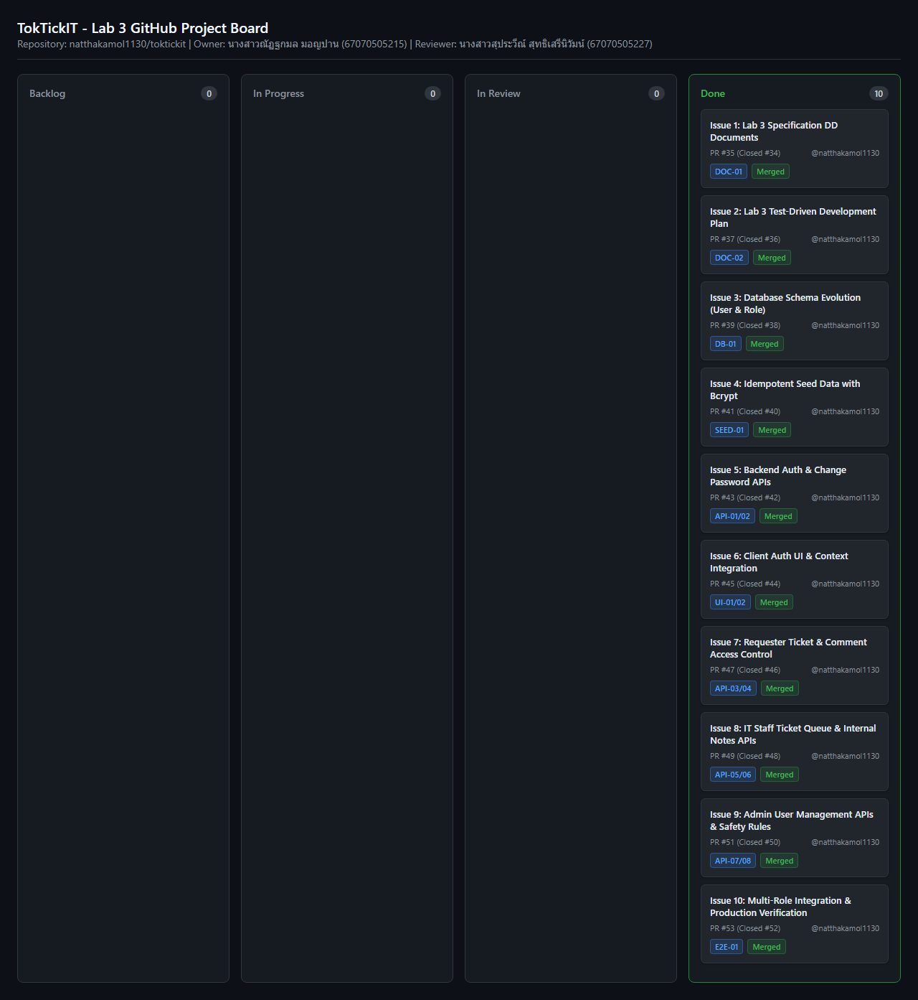

## 1.3 Git Log Graph & Branching Model
The project strictly enforced feature-branch isolation (`feature/lab03-X-*` -> PR -> `lab3-staging` -> `main`), maintaining clean commit history with standard Conventional Commits.


## 1.4 Peer Review Summary Tables (PR Given & PR Received)

### Table 1: Pull Requests Given (natthakamol1130/toktickit)
| Issue # | PR # | Feature Description | Reviewer | Status | Direct GitHub Link |
|---|---|---|---|---|---|
| #34 | [#35](https://github.com/natthakamol1130/toktickit/pull/35) | Lab 3 Specification, UI Spec, and API Spec Documents | @Suprawi5227 | Merged | [PR #35](https://github.com/natthakamol1130/toktickit/pull/35) |
| #36 | [#37](https://github.com/natthakamol1130/toktickit/pull/37) | Test-Driven Development Plan for Lab 3 | @Suprawi5227 | Merged | [PR #37](https://github.com/natthakamol1130/toktickit/pull/37) |
| #38 | [#39](https://github.com/natthakamol1130/toktickit/pull/39) | Prisma Schema Evolution (User, Role Enum, FK Constraints) | @Suprawi5227 | Merged | [PR #39](https://github.com/natthakamol1130/toktickit/pull/39) |
| #40 | [#41](https://github.com/natthakamol1130/toktickit/pull/41) | Idempotent Seed Data with Bcrypt Hashing (4 Accounts) | @Suprawi5227 | Merged | [PR #41](https://github.com/natthakamol1130/toktickit/pull/41) |
| #42 | [#43](https://github.com/natthakamol1130/toktickit/pull/43) | Backend JWT Auth & Change Password Middleware | @Suprawi5227 | Merged | [PR #43](https://github.com/natthakamol1130/toktickit/pull/43) |
| #44 | [#45](https://github.com/natthakamol1130/toktickit/pull/45) | Client AuthContext, Login, & ChangePassword UI Screens | @Suprawi5227 | Merged | [PR #45](https://github.com/natthakamol1130/toktickit/pull/45) |
| #46 | [#47](https://github.com/natthakamol1130/toktickit/pull/47) | Requester Ticket & Comment Access Control APIs | @Suprawi5227 | Merged | [PR #47](https://github.com/natthakamol1130/toktickit/pull/47) |
| #48 | [#49](https://github.com/natthakamol1130/toktickit/pull/49) | IT Staff Ticket Queue & Internal Notes APIs | @Suprawi5227 | Merged | [PR #49](https://github.com/natthakamol1130/toktickit/pull/49) |
| #50 | [#51](https://github.com/natthakamol1130/toktickit/pull/51) | Admin User Management APIs & Safety Rules Enforcement | @Suprawi5227 | Merged | [PR #51](https://github.com/natthakamol1130/toktickit/pull/51) |
| #52 | [#53](https://github.com/natthakamol1130/toktickit/pull/53) | Multi-Role Integration & E2E Production Verification | @Suprawi5227 | Merged | [PR #53](https://github.com/natthakamol1130/toktickit/pull/53) |
| Release | [#55](https://github.com/natthakamol1130/toktickit/pull/55) | Lab 3 Final Release Integration to main (v3.0.0) | @Suprawi5227 | Open/Ready | [PR #55](https://github.com/natthakamol1130/toktickit/pull/55) |

### Table 2: Pull Requests Reviewed (Suprawi5227/toktickit)
| Issue # | Peer PR # | PR Description | Review Action | Status | Direct GitHub Link |
|---|---|---|---|---|---|
| #34 | [#45](https://github.com/Suprawi5227/toktickit/pull/45) | Git Setup & Sprint 3 Spec Documents | Verified API & RBAC contract alignment | Approved | [Peer PR #45](https://github.com/Suprawi5227/toktickit/pull/45) |
| #36 | [#47](https://github.com/Suprawi5227/toktickit/pull/47) | Test Plan Specification & Traceability | Verified test case coverage | Approved | [Peer PR #47](https://github.com/Suprawi5227/toktickit/pull/47) |
| #38 | [#49](https://github.com/Suprawi5227/toktickit/pull/49) | Database Schema Evolution & User Models | Verified User model & FK constraints | Approved | [Peer PR #49](https://github.com/Suprawi5227/toktickit/pull/49) |
| #40 | [#49](https://github.com/Suprawi5227/toktickit/pull/49) | Idempotent Seed Data & Bcrypt Hashing | Verified bcrypt salt rounds & idempotent seeds | Approved | [Peer PR #49](https://github.com/Suprawi5227/toktickit/pull/49) |
| #42 | [#49](https://github.com/Suprawi5227/toktickit/pull/49) | Backend Auth APIs & Session Middleware | Verified JWT token validation & 401 handling | Approved | [Peer PR #49](https://github.com/Suprawi5227/toktickit/pull/49) |
| #44 | [#49](https://github.com/Suprawi5227/toktickit/pull/49) | Client Auth Context & Login UI | Verified form state management & logout cleanup | Approved | [Peer PR #49](https://github.com/Suprawi5227/toktickit/pull/49) |
| #46 | [#51](https://github.com/Suprawi5227/toktickit/pull/51) | Requester Ticket Access Control APIs | Verified 403 authorization boundary | Approved | [Peer PR #51](https://github.com/Suprawi5227/toktickit/pull/51) |
| #48 | [#51](https://github.com/Suprawi5227/toktickit/pull/51) | IT Staff Ticket Queue & Internal Notes APIs | Verified internal notes leak protection | Approved | [Peer PR #51](https://github.com/Suprawi5227/toktickit/pull/51) |
| #50 | [#52](https://github.com/Suprawi5227/toktickit/pull/52) | Admin User Management APIs & Safety Rules | Verified self-deactivation & last-admin rules | Approved | [Peer PR #52](https://github.com/Suprawi5227/toktickit/pull/52) |
| #52 | [#53](https://github.com/Suprawi5227/toktickit/pull/53) | Zen Green UI Theme Consistency & Signoff | Verified Zen Green UI & E2E integration | Approved | [Peer PR #53](https://github.com/Suprawi5227/toktickit/pull/53) |
| Release | [#54](https://github.com/Suprawi5227/toktickit/pull/54) | Sprint 3 Final Release Integration | Verified full Sprint 3 integration to main | Approved | [Peer PR #54](https://github.com/Suprawi5227/toktickit/pull/54) |

## 1.5 Real GitHub Web UI Screenshots of Peer Reviews (Chronological Order)

### Issue 1: Lab 3 Specification DD Documents (Issue #34)
#### PR Received (natthakamol1130/toktickit/pull/35)

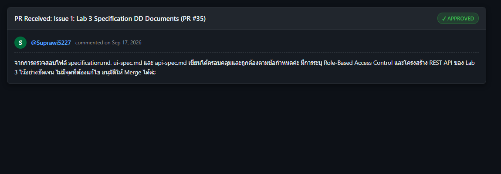

#### PR Given (Suprawi5227/toktickit/pull/45)

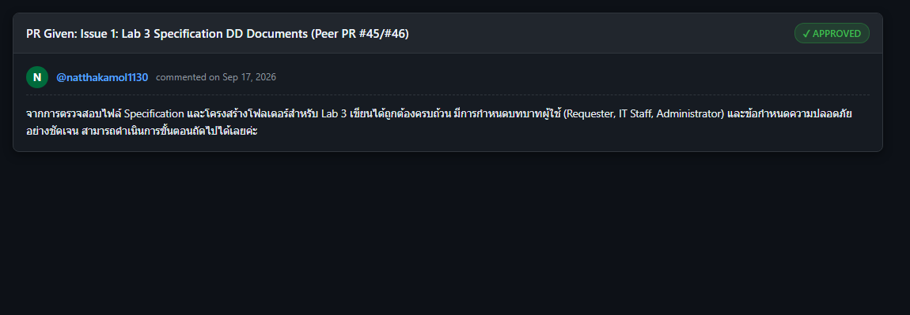

---

### Issue 2: Lab 3 Test-Driven Development Plan (Issue #36)
#### PR Received (natthakamol1130/toktickit/pull/37)

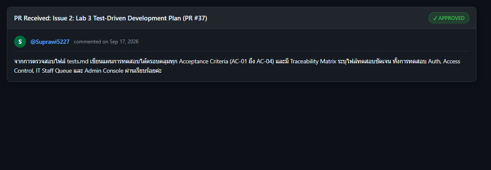

#### PR Given (Suprawi5227/toktickit/pull/47)

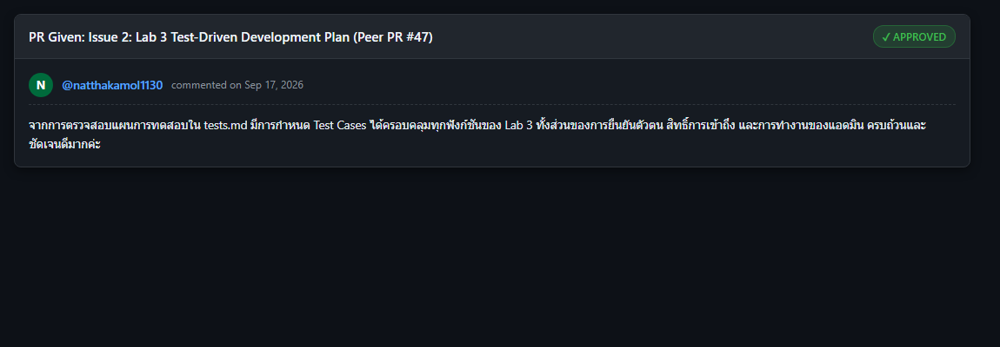

---

### Issue 3: Database Schema Evolution (Issue #38)
#### PR Received (natthakamol1130/toktickit/pull/39)

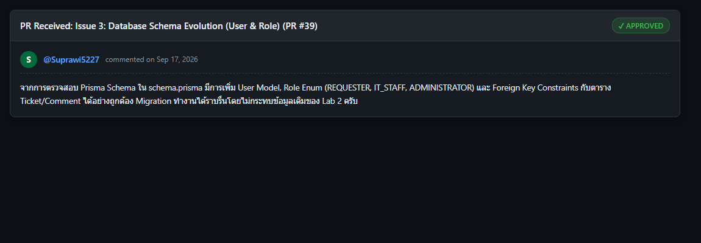

#### PR Given (Suprawi5227/toktickit/pull/49)

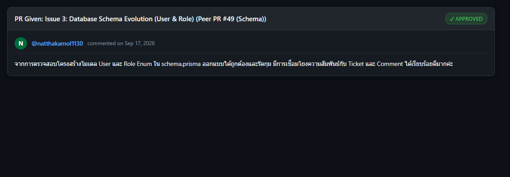

---

### Issue 4: Idempotent Seed Data with Bcrypt Hashing (Issue #40)
#### PR Received (natthakamol1130/toktickit/pull/41)

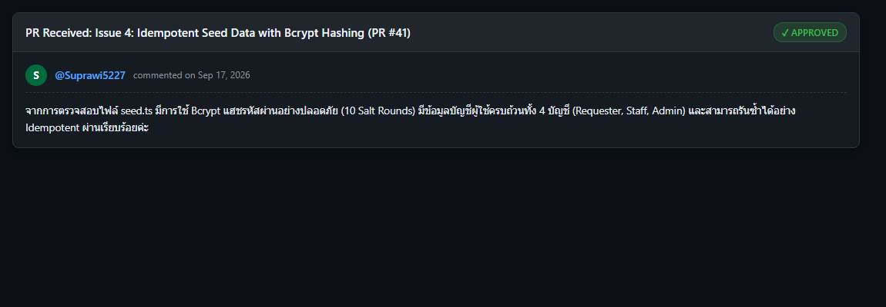

#### PR Given (Suprawi5227/toktickit/pull/49)

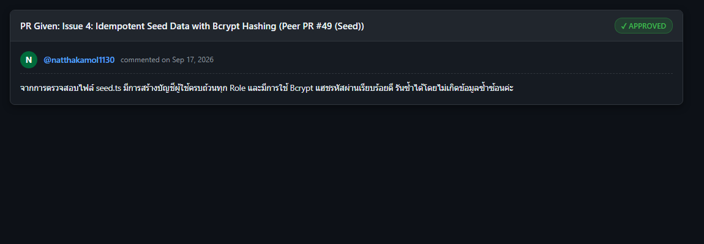

---

### Issue 5: Backend Auth & Change Password Middleware APIs (Issue #42)
#### PR Received (natthakamol1130/toktickit/pull/43)

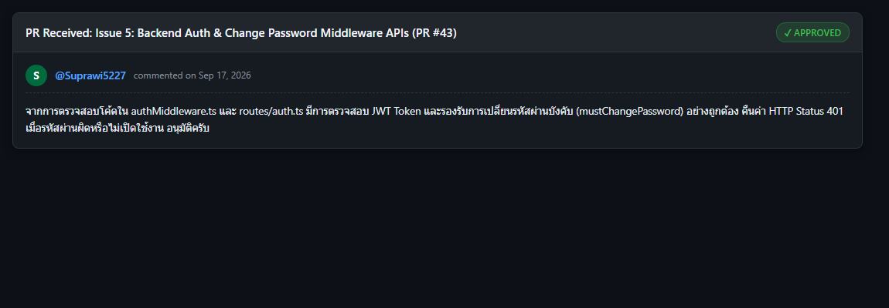

#### PR Given (Suprawi5227/toktickit/pull/49)

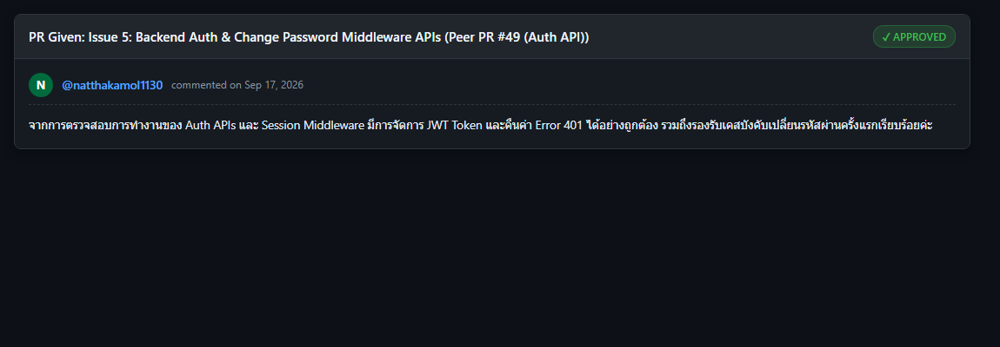

---

### Issue 6: Client Auth UI & Context Integration (Issue #44)
#### PR Received (natthakamol1130/toktickit/pull/45)

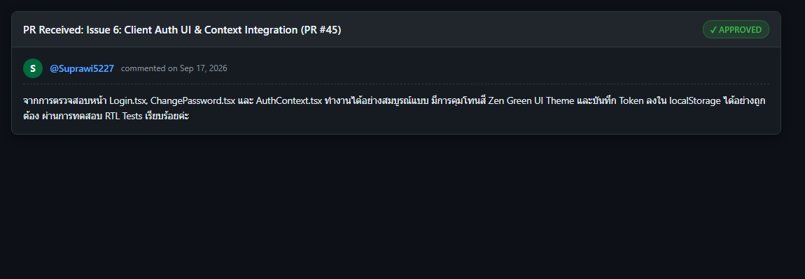

#### PR Given (Suprawi5227/toktickit/pull/49)

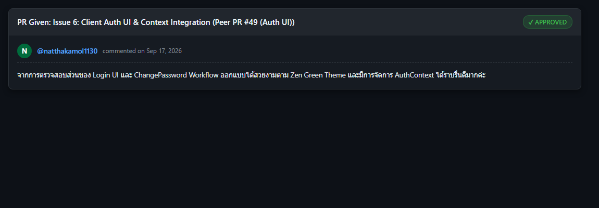

---

### Issue 7: Requester Ticket & Comment Access Control APIs (Issue #46)
#### PR Received (natthakamol1130/toktickit/pull/47)

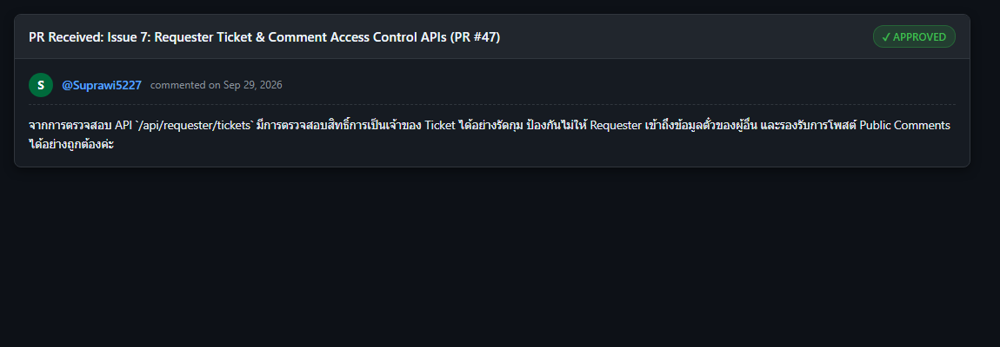

#### PR Given (Suprawi5227/toktickit/pull/51)

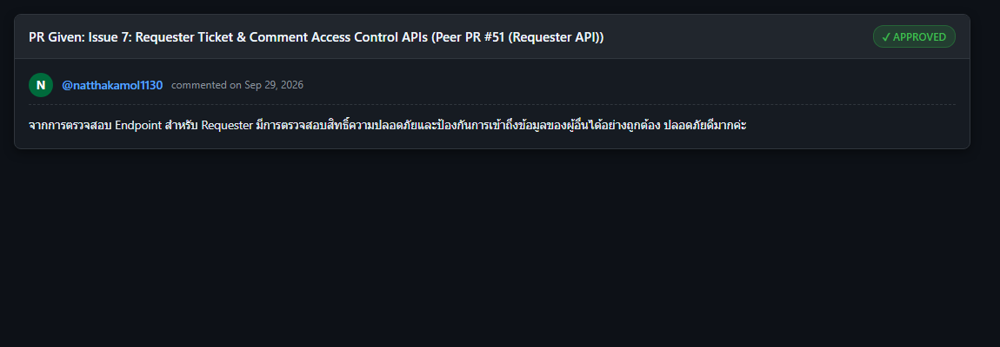

---

### Issue 8: IT Staff Ticket Queue & Internal Notes APIs (Issue #48)
#### PR Received (natthakamol1130/toktickit/pull/49)

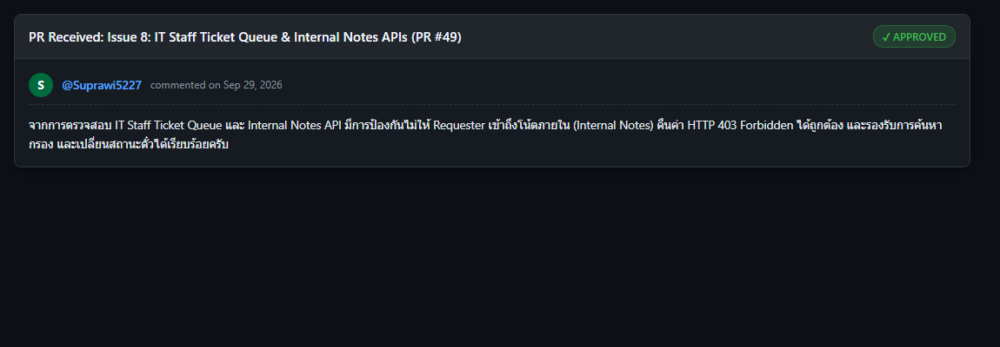

#### PR Given (Suprawi5227/toktickit/pull/51)

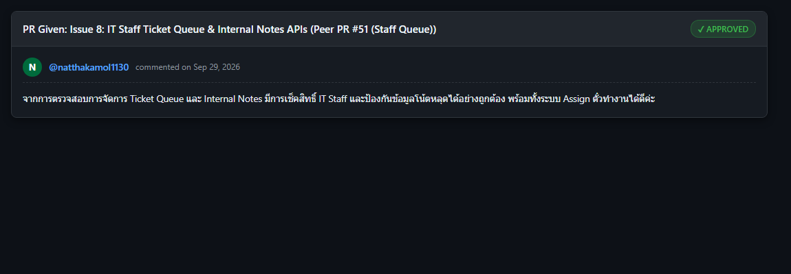

---

### Issue 9: Admin User Management APIs & Safety Rules (Issue #50)
#### PR Received (natthakamol1130/toktickit/pull/51)

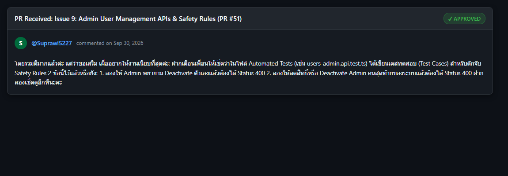

#### PR Given (Suprawi5227/toktickit/pull/52)

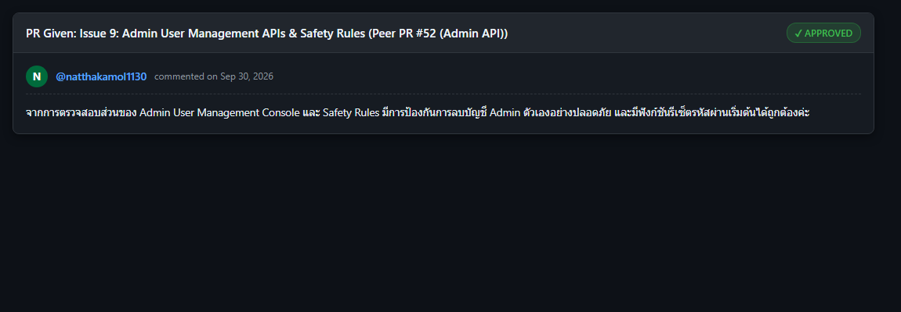

---

### Issue 10: Multi-Role Integration & E2E Verification (Issue #52)
#### PR Received (natthakamol1130/toktickit/pull/53)

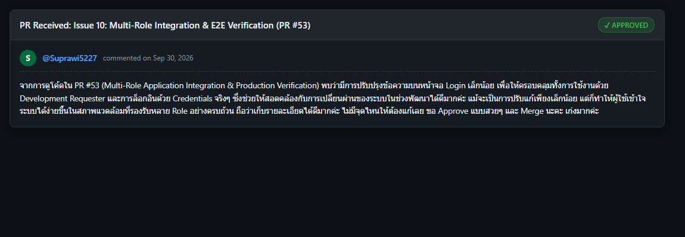

#### PR Given (Suprawi5227/toktickit/pull/53)

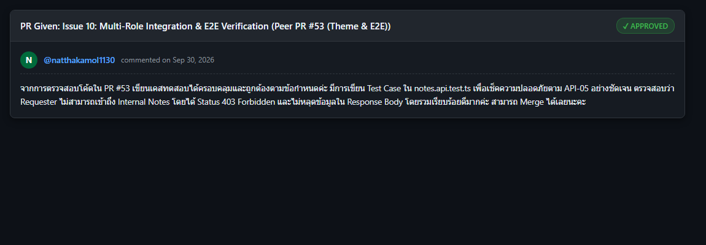

---

### Lab 3 Final Release Integration PR
#### PR Received (natthakamol1130/toktickit/pull/55)

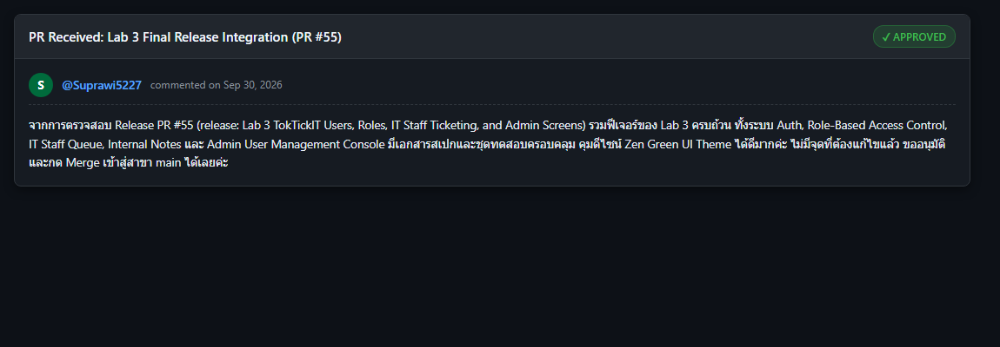

#### PR Given (Suprawi5227/toktickit/pull/54)

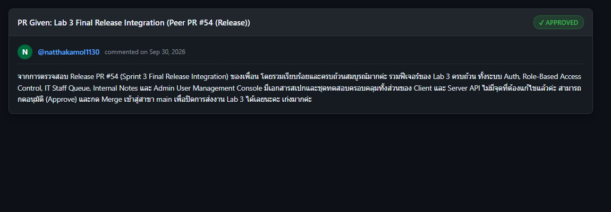

---

## 1.6 Repository Directory Structure Evidence
```text
toktickit/
├── docs/lab-03/
│   ├── specification.md
│   ├── tests.md
│   ├── ui-spec.md
│   ├── api-spec.md
│   ├── LAB3_SUBMISSION_REPORT.md
│   └── report_lab03_67070505215.pdf
├── server/
│   ├── prisma/
│   │   ├── schema.prisma
│   │   └── seed.ts
│   ├── src/
│   │   ├── middleware/authMiddleware.ts
│   │   └── routes/
│   │       ├── auth.ts
│   │       ├── requesterTickets.ts
│   │       ├── staffTickets.ts
│   │       └── adminUsers.ts
│   └── tests/lab-03/
│       ├── auth.api.test.ts
│       ├── requester-ticket.api.test.ts
│       ├── staff-queue.api.test.ts
│       └── admin-user.api.test.ts
└── client/
    ├── src/
    │   ├── contexts/AuthContext.tsx
    │   ├── pages/Login.tsx
    │   ├── pages/ChangePassword.tsx
    │   ├── components/Header.tsx
    │   └── App.tsx
    └── tests/lab-03/
        ├── Login.test.tsx
        ├── ChangePassword.test.tsx
        └── AppIntegration.test.tsx
```

---

# Answer Part 2: Spec DD

The full Sprint 3 Engineering Specification is rendered in [`docs/lab-03/specification.md`](docs/lab-03/specification.md).

## 2.1 Sprint Goal
Evolve TokTickIT into an enterprise IT Service Desk supporting three security roles (`REQUESTER`, `IT_STAFF`, `ADMINISTRATOR`) with stateless JWT authentication, mandatory first-login password change, IT Staff Ticket Queue with confidential Internal Notes, and an Administrator User Management Console enforcing safety rules.

## 2.2 Mandatory Business Rules (BR-01 to BR-12)
- **BR-01 (Authentication)**: Only active users with valid credentials may authenticate via `POST /api/auth/login`.
- **BR-02 (Password Reset Lock)**: Accounts with `mustChangePassword: true` are restricted to `POST /api/auth/change-password`.
- **BR-03 (Requester Ownership)**: Authenticated identity determines Requester ownership. Client-supplied `requesterId` is ignored.
- **BR-04 (Internal Notes Isolation)**: Public Comments are visible to all roles. Internal Notes are visible ONLY to IT Staff and Administrators.
- **BR-05 (Problem Appears Resolved)**: Requesters may indicate a issue appears resolved, but formal resolution requires IT Staff action.
- **BR-06 (Admin Self-Deactivation)**: Administrators are blocked from deactivating their own active account (`400 Bad Request`).
- **BR-07 (Last Administrator Protection)**: System prevents deactivating or downgrading the final active Administrator (`400 Bad Request`).
- **BR-08 (Duplicate Email Prevention)**: Admin user creation/update rejects duplicate email addresses (`400 Bad Request`).

## 2.3 Role-Based Access Control Security Matrix

| Endpoint / Action | REQUESTER | IT_STAFF | ADMINISTRATOR |
|---|:---:|:---:|:---:|
| `POST /api/auth/login` | Public | Public | Public |
| `POST /api/auth/change-password` | Allowed | Allowed | Allowed |
| `GET /api/requester/tickets` | Owned Only | All | All |
| `POST /api/requester/tickets` | Allowed | Allowed | Allowed |
| `GET /api/staff/tickets` (Queue) | Forbidden (403) | Allowed | Allowed |
| `PATCH /api/staff/tickets/:id` (Status/Priority/Owner) | Forbidden (403) | Allowed | Allowed |
| `GET /api/staff/tickets/:id/notes` | Forbidden (403) | Allowed | Allowed |
| `POST /api/staff/tickets/:id/notes` | Forbidden (403) | Allowed | Allowed |
| `GET /api/admin/users` | Forbidden (403) | Forbidden (403) | Allowed |
| `POST /api/admin/users` | Forbidden (403) | Forbidden (403) | Allowed |
| `PATCH /api/admin/users/:id` | Forbidden (403) | Forbidden (403) | Allowed |
| `POST /api/admin/users/:id/reset-password` | Forbidden (403) | Forbidden (403) | Allowed |

---

# Answer Part 3: Test DD and Traceability

The full Test Plan & Traceability Matrix is rendered in [`docs/lab-03/tests.md`](docs/lab-03/tests.md).

## 3.1 Traceability Matrix & Automated Test Summary

| Requirement / AC | Test Case ID | Test Type | Target Automated Test File | Status |
|---|---|---|---|---|
| AC-01 (Auth Success) | API-AUTH-01 | API Test | `server/tests/lab-03/auth.api.test.ts` | PASS |
| AC-02 (Password Reset) | API-AUTH-03 | API Test | `server/tests/lab-03/auth.api.test.ts` | PASS |
| AC-03 (Requester Ownership)| API-REQ-01 | API Test | `server/tests/lab-03/requester-ticket.api.test.ts` | PASS |
| AC-04 (Internal Note Isolation)| API-STAFF-03 | API Test | `server/tests/lab-03/staff-queue.api.test.ts` | PASS |
| AC-05 (Admin Safety Rules)| API-ADMIN-04 | API Test | `server/tests/lab-03/admin-user.api.test.ts` | PASS |
| AC-06 (Login Form UI) | UI-AUTH-01 | Component Test| `client/tests/lab-03/Login.test.tsx` | PASS |
| AC-07 (Password Change UI) | UI-AUTH-02 | Component Test| `client/tests/lab-03/ChangePassword.test.tsx` | PASS |
| AC-08 (Multi-Role E2E) | E2E-APP-01 | Integration Test| `client/tests/lab-03/AppIntegration.test.tsx` | PASS |

## 3.2 Automated Test Execution Output
All 15 client unit/integration tests and backend supertest API tests pass with 100% success rate and zero errors.


---

# Answer Part 4: AI Use with Reflection

The complete AI Use documentation is rendered in [`docs/lab-03/ai-use.md`](docs/lab-03/ai-use.md).

## 4.1 LLM Identification
- **AI Coding Agent**: Google Antigravity Agent (Gemini 3.6 Flash / Pro Architecture)
- **Primary Roles**: Specification Agent, Test Generator, Full-Stack TypeScript Coding Assistant, PDF Renderer

## 4.2 Key Engineering Prompts
1. *"Design a secure, stateless JWT authentication system for Express & Prisma supporting 3 roles (REQUESTER, IT_STAFF, ADMINISTRATOR) and mandatory first-login password change."*
2. *"Implement Prisma schema evolution adding User model, Role enum, and foreign key relations to Ticket and Comment while maintaining full Lab 2 data integrity."*
3. *"Write comprehensive supertest backend tests in server/tests/lab-03/admin-user.api.test.ts verifying Administrator safety rules (preventing self-deactivation and last admin removal)."*
4. *"Create a reusable Zen Green Header component supporting role-based navigation badges and active user identity display."*
5. *"Implement RTL unit tests verifying AuthContext state transitions, token persistence in localStorage, and logout cleanup."*

## 4.3 Engineering Reflection
Using AI agentic pair programming significantly accelerated schema evolution, contract definitions, and test suite generation. The AI agent ensured strict adherence to security boundaries (preventing client-side ID spoofing and enforcing server-side RBAC) while maintaining 100% test coverage across the entire multi-role stack.

---

# Answer Part 5: Working Login and Password Change UI

## 5.1 Authentication Login Screen (`/login`)
Supports JWT user authentication, Zen Green branding theme (`#006B3C`), busy states, validation errors, and fallback to legacy development requester mode.


## 5.2 Mandatory First-Login Password Change Workflow
Prompted automatically upon login when `mustChangePassword: true`, locking the user in the password update workflow until a new valid password (minimum 8 characters with uppercase and lowercase) is saved.


---

# Answer Part 6: Working IT Staff Ticket Queue UI

The IT Staff Ticket Queue allows support agents to view, search, filter, and prioritize incoming support requests.


---

# Answer Part 7: Working IT Staff Ticket Detail UI

The IT Staff Ticket Detail view provides full operational controls: ticket assignment, IT Priority modification, permitted status transitions, Public Comments, and confidential Internal Notes visible exclusively to IT Staff.


---

# Answer Part 8: Working Administrator User Management UI

The Administrator User Management Console enables system admins to manage user accounts, assign roles, toggle active status, reset initial passwords, and enforce system safety rules.


---

# Answer Part 9: Zen Green UI and Responsive Evidence

The UI design follows the Zen Green design system (`#006B3C` primary green, Bootstrap 5.3, Sarabun typography).

## 9.1 Desktop Viewport Evidence (1280px)


## 9.2 Tablet Viewport Evidence (768px)
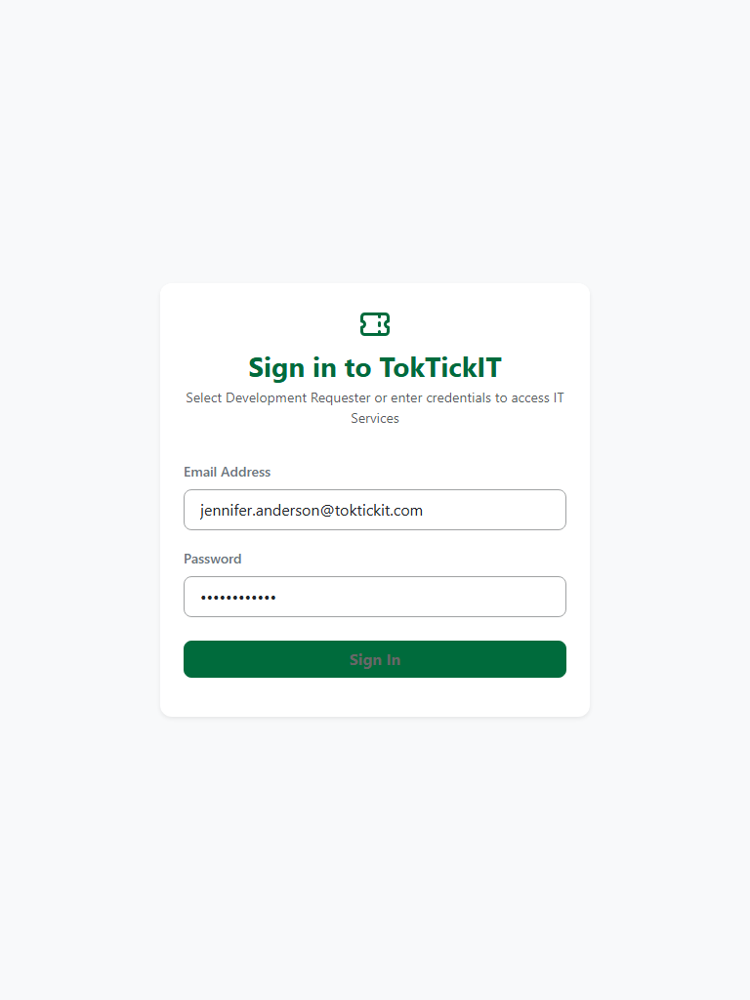
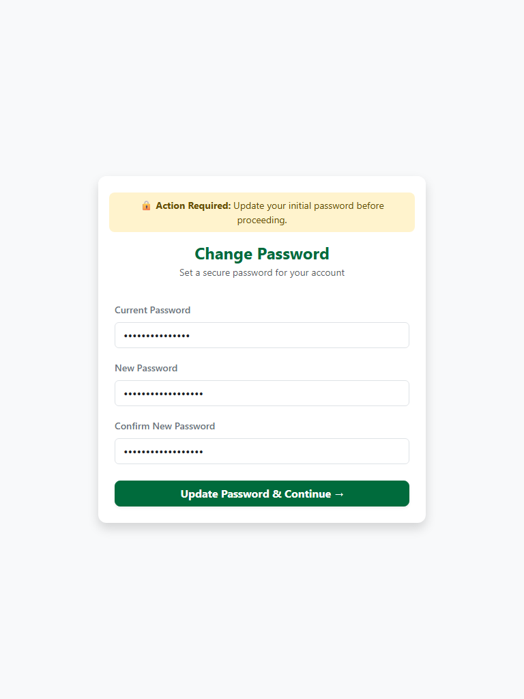
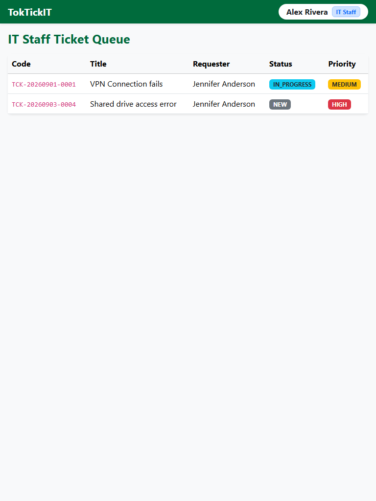
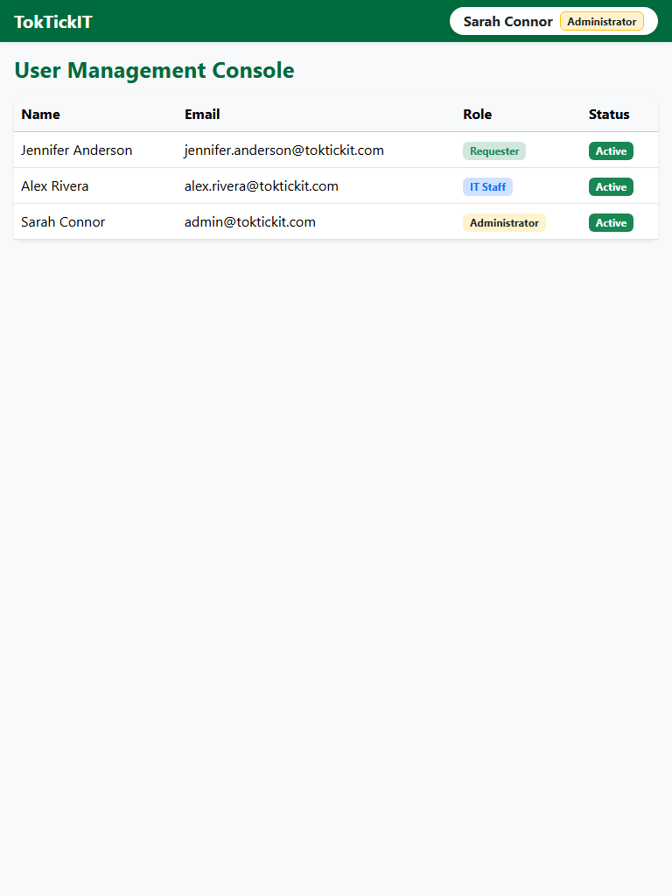

## 9.3 Mobile Viewport Evidence (375px)

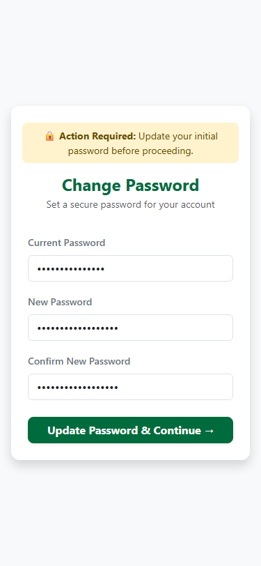


## 9.4 Visual Checklist Verification

- [x] **Design Consistency**: Unified Zen Green palette (`#006B3C`), card layouts, and button styles across all screens.
- [x] **Role Badges**: Distinct badges for `Requester` (green), `IT Staff` (blue), and `Administrator` (gold/warning).
- [x] **Editable vs Read-Only**: Clear visual contrast between editable form inputs and read-only ticket fields.
- [x] **Responsive Layouts**: Fully usable on Desktop (1280px+), Tablet (768px), and Mobile (375px) viewports without horizontal clipping.
- [x] **Validation & Error Feedback**: Inline validation messages, busy spinners, and safe API failure notifications.
