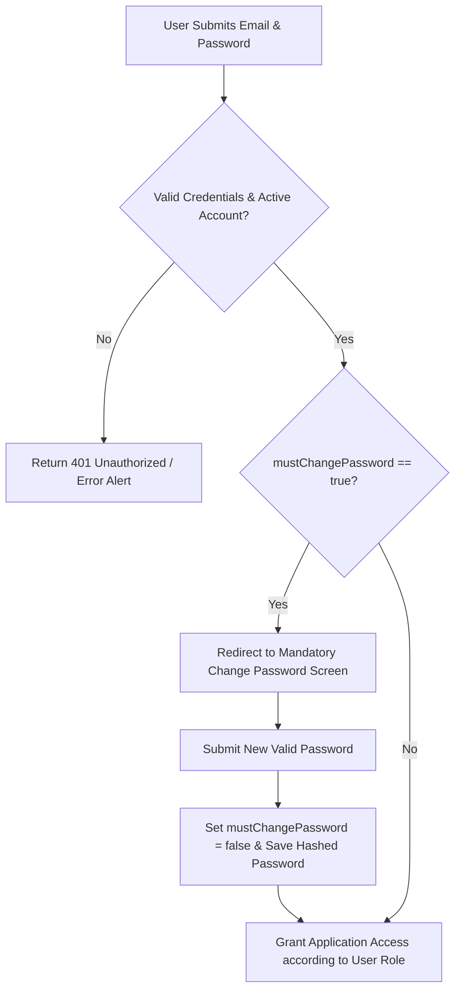
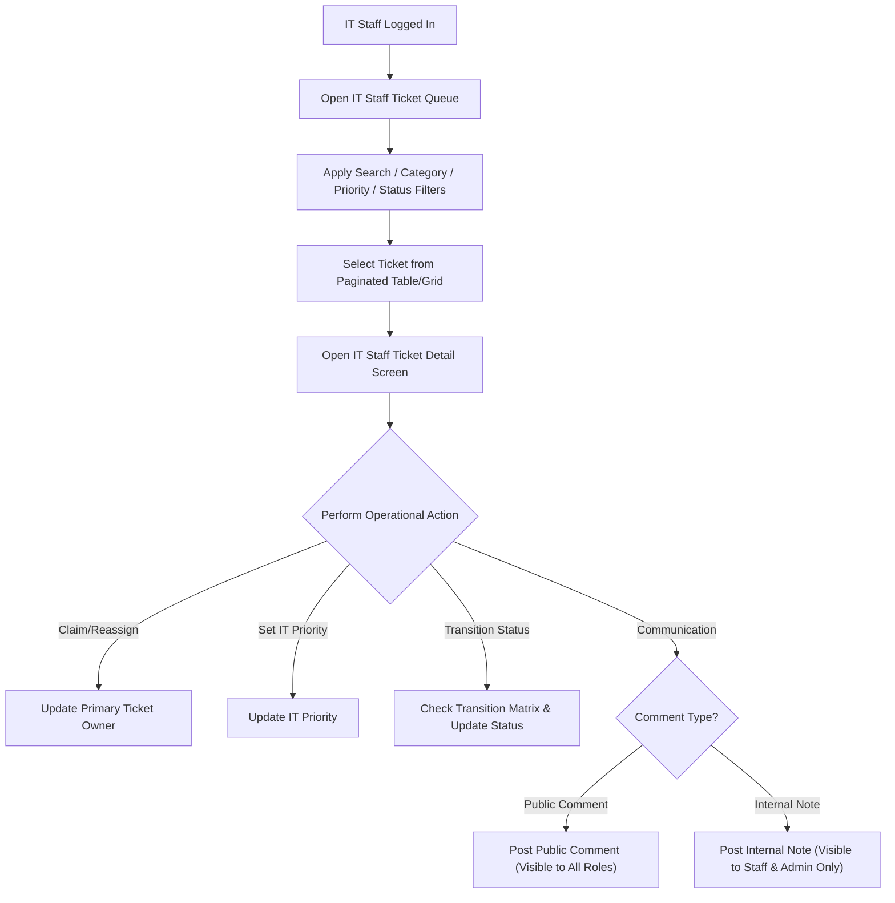
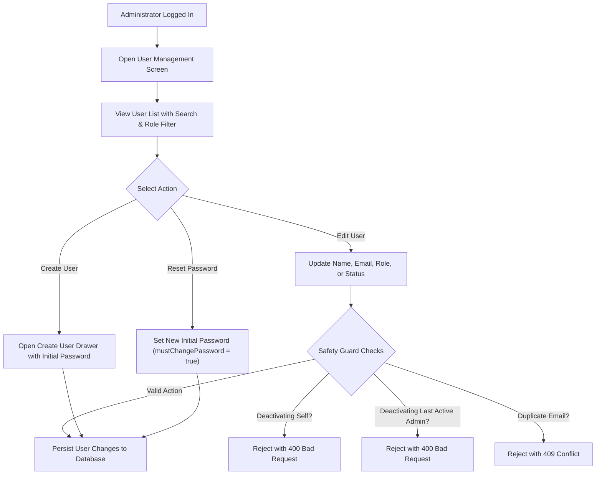

# Lab 3 Sprint Engineering Specification

## 1. Sprint Goal
Deliver an operational, secure, multi-role web application increment for TokTickIT. This increment replaces the temporary Development Requester selector with secure user authentication and role-based access control, introduces a dedicated IT Staff Ticket Queue with ownership management, IT Priority, status workflow, Public Comments, and role-restricted Internal Notes, and provides a minimalist Administrator User Management interface, all adhering to the Zen Green design language and preserving completed Lab 2 functionality.

## 2. Stakeholder Request Interpretation
The system now requires real authenticated users and role-based access control across three primary roles: Requester, IT Staff, and Administrator. Login must authenticate via email and password, enforcing a mandatory first-login password change for accounts created with initial passwords. Requesters must continue creating and tracking their owned tickets while gaining the ability to post Public Comments and indicate problem resolution. IT Staff require a professional Ticket Queue with search, filtering, sorting, and pagination, along with ticket detail workflows to claim/reassign ownership, set IT Priority, transition statuses, write Public Comments, and record private Internal Notes. Administrators require a minimalist User Management screen to manage user accounts, assign single roles, activate/deactivate accounts, and reset initial passwords with strict safety rules preventing self-deactivation or leaving the system with no active Administrator.

## 3. Workflow Diagrams

### 3.1 Authentication & First-Login Password Change Flowchart

### 3.2 IT Staff Ticket Queue & Detail Operations Flowchart

### 3.3 Administrator User Management & Safety Guards Flowchart

---

## 4. Scope

### Included
- **Authentication & Security Engine**: Password hashing using bcrypt, session/token authentication, login/logout, current user retrieval (`GET /api/auth/me`), and mandatory first-login password change enforcement (`mustChangePassword = true`).
- **Role-Based Authorization & Navigation**: Role-based access control (`REQUESTER`, `IT_STAFF`, `ADMINISTRATOR`) enforced strictly on the backend with role-adapted UI navigation and controls.
- **Lab 2 Requester Continuation & Regression**: Preservation of ticket creation, ticket list ("My Tickets"), ticket detail, and attachment management, with authentication replacing the temporary selector.
- **Requester Enhancement**: Ability to post Public Comments on owned tickets and mark tickets with "Problem Appears Resolved".
- **IT Staff Ticket Queue**: Comprehensive queue listing supporting keyword search (Ticket Number, Summary), category/priority/status filters, multi-field sorting, and pagination.
- **IT Staff Ticket Operations**: Primary Ticket Owner assignment (Claim/Reassign), IT Priority updates, permitted status transitions (`New`, `Open`, `In Progress`, `Waiting for Requester`, `Resolved`, `Closed`, `Reopened`, `Cancelled`), Public Comments, and role-restricted Internal Notes.
- **Administrator User Management**: Minimalist User Management screen displaying user list with search by name/email, role filtering, user creation with initial password, user editing, account activation/deactivation, and setting new initial passwords.
- **Administrator Safety Guards**: Rules preventing duplicate email registration, self-deactivation by an Administrator, and deactivation of the final active Administrator.
- **Data Model & Migration**: Schema evolution from Lab 2 Dev Requester to unified `User` model, maintaining data integrity for existing tickets and attachments.
- **Idempotent Seed Data**: Seeding active and inactive accounts for all three roles and realistic ticket data with comments and notes.

### Excluded
- Email delivery services (email invitations, password reset emails).
- Self-registration / public sign-up workflows.
- Multi-factor authentication (MFA), OAuth, or Single Sign-On (SSO).
- IT Staff Actions Taken tracking (deferred to Lab 4).
- Formal SLA calculation engines, escalation rules, and push notifications.
- KPI dashboards beyond basic queue counts.
- Multi-tenant organizational structures or departments.
- Multiple roles per user (each user has exactly one role).
- User deletion, bulk user operations, import/export, and account audit history.

## 5. Functional Requirements
- **FR-01**: The system shall authenticate users via valid email and password credentials.
- **FR-02**: The system shall block normal application access for users marked as requiring a password change until a valid new password is saved.
- **FR-03**: The system shall provide an authenticated current user retrieval endpoint (`GET /api/auth/me`) returning user identity and assigned role.
- **FR-04**: The system shall enforce role-based authorization on all protected backend endpoints.
- **FR-05**: The system shall provide IT Staff with a Ticket Queue supporting keyword search across Ticket Number and Summary.
- **FR-06**: The system shall allow IT Staff to filter the Ticket Queue by Category, Requested Priority, IT Priority, and Status.
- **FR-07**: The system shall allow IT Staff to sort the Ticket Queue by Creation Date, Ticket Number, IT Priority, or Status in ascending/descending order.
- **FR-08**: The system shall paginate the IT Staff Ticket Queue with configurable page sizes and metadata.
- **FR-09**: The system shall allow IT Staff to claim unassigned tickets or reassign primary ticket ownership to an active IT Staff or Administrator.
- **FR-10**: The system shall allow IT Staff to update IT Priority separately from Requester-submitted Requested Priority.
- **FR-11**: The system shall enforce permitted status transition workflows (`New` -> `Open`, `In Progress`, `Waiting for Requester`, `Resolved`, `Closed`, `Reopened`, `Cancelled`).
- **FR-12**: The system shall support append-only Public Comments visible to Requester, IT Staff, and Administrator.
- **FR-13**: The system shall support append-only Internal Notes visible exclusively to IT Staff and Administrator, blocking Requester access with HTTP 403 Forbidden.
- **FR-14**: The system shall allow Requesters to indicate that a reported problem appears resolved.
- **FR-15**: The system shall provide Administrators with a User Management interface listing users with Name, Email, Role, Status, and Edit action.
- **FR-16**: The system shall allow Administrators to search users by name or email and filter by role.
- **FR-17**: The system shall allow Administrators to create user accounts with Name, Email, single Role, Activation State, and Initial Password.
- **FR-18**: The system shall allow Administrators to edit user Name, Email, Role, and Activation State.
- **FR-19**: The system shall allow Administrators to set a new Initial Password for a user, marking `mustChangePassword = true`.

## 6. Business Rules
- **BR-01**: Only an active user account (`isActive = true`) with valid credentials may authenticate successfully.
- **BR-02**: A user marked with `mustChangePassword = true` cannot access normal application screens until a new valid password is saved.
- **BR-03**: Authenticated User Identity: The authenticated user session/token determines identity and ownership on all endpoints; client-supplied user IDs are ignored for authorization.
- **BR-04**: Public Comments vs. Internal Notes: Public Comments are shared communication visible to Requester, IT Staff, and Administrator. Internal Notes are operational notes visible ONLY to IT Staff and Administrator.
- **BR-05**: Resolution Authority: A Requester may indicate that a problem appears resolved, but only IT Staff or Administrator may formally set ticket status to `Resolved` or `Closed`.
- **BR-06**: Password Validation: New passwords must be at least 8 characters long and include uppercase, lowercase, number, and special character. Passwords must be hashed using bcrypt before database storage.
- **BR-07**: Unique Email Rule: Every user account must have a unique email address across the entire application.
- **BR-08**: Single Role Assignment: Each user account must be assigned exactly one role (`REQUESTER`, `IT_STAFF`, or `ADMINISTRATOR`).
- **BR-09**: Administrator Self-Deactivation Guard: An Administrator cannot deactivate their own active account.
- **BR-10**: Final Administrator Protection: The system shall reject any request that would result in zero active Administrator accounts.
- **BR-11**: User Preservation: Users cannot be deleted; account access control is managed strictly via `isActive` status (Deactivation).
- **BR-12**: Ticket Ownership: A ticket may have zero or one primary Ticket Owner (an active IT Staff or Administrator). Requested Priority is immutable by IT Staff, while IT Priority is managed by IT Staff/Admin.
- **BR-13**: Comment and Note Content: Comments and Notes are append-only. Content must be trimmed, non-empty, and limited to 1 to 2000 characters.

## 7. UI Specification Summary
The UI extends the **Zen Green Design System**:
- **Application Shell**: Displays app header "TokTickIT", active navigation links based on role, authenticated user name and role badge, and Logout action.
- **Login Screen**: Clean card centered layout with Email and Password fields, submit busy state, field validation, and safe error alerts for inactive or invalid accounts.
- **Mandatory Password Change Screen**: Modal/page requiring current (initial) password and new password with real-time rule validation checklist and confirmation field.
- **Requester Ticket Detail Screen**: Preserves Lab 2 ticket details and attachments, adds a distinct Public Comments section with author badges, and adds "Problem Appears Resolved" action button.
- **IT Staff Ticket Queue Screen**: Search bar, filter controls (Category, Requested Priority, IT Priority, Status), sort selectors, paginated Zen Green table (desktop) / card grid (mobile), ownership badges, and quick-action view detail links.
- **IT Staff Ticket Detail Screen**: Operational editing sidebar (Owner dropdown, IT Priority dropdown, Status transition dropdown), two tabbed/stacked communication panels: Public Comments (Green border) and Internal Notes (Amber/Yellow border, "Internal Only" badge).
- **Administrator User Management Screen**: User list table with Search, Role filter dropdown, "Create User" action button, inline edit actions, and "Create / Edit User" modal/drawer with Initial Password reset options.

## 8. Data Changes

### Models & Schema Updates (Prisma)
- **`User`**: `id` (Int PK), `email` (String Unique), `passwordHash` (String), `name` (String), `role` (Enum: `REQUESTER`, `IT_STAFF`, `ADMINISTRATOR`), `isActive` (Boolean default true), `mustChangePassword` (Boolean default true), `createdAt` (DateTime), `updatedAt` (DateTime).
- **`Ticket`**: Added `ownerId` (Int FK -> User nullable), `itPriority` (Enum: `LOW`, `MEDIUM`, `HIGH`, `URGENT` nullable), `requesterId` (Int FK -> User).
- **`PublicComment`**: `id` (Int PK), `ticketId` (Int FK -> Ticket), `authorId` (Int FK -> User), `content` (Text), `createdAt` (DateTime).
- **`InternalNote`**: `id` (Int PK), `ticketId` (Int FK -> Ticket), `authorId` (Int FK -> User), `content` (Text), `createdAt` (DateTime).

### Indexes & Constraints
- Unique index on `User(email)`.
- Index on `User(role, isActive)` for user management filtering.
- Index on `Ticket(ownerId, status)` for IT Staff Queue queries.
- Index on `PublicComment(ticketId, createdAt)` and `InternalNote(ticketId, createdAt)`.

## 9. API Contract Summary
- **Auth**: `POST /api/auth/login`, `POST /api/auth/logout`, `GET /api/auth/me`, `POST /api/auth/change-password`.
- **Requester**: Continuation of Lab 2 ticket and attachment APIs with session auth.
- **IT Staff Queue**: `GET /api/staff/tickets` (search, filters, sort, pagination).
- **IT Staff Operations**: `GET /api/staff/tickets/:id`, `PATCH /api/staff/tickets/:id/assign`, `PATCH /api/staff/tickets/:id/workflow`.
- **Comments & Notes**: `GET /api/tickets/:id/comments`, `POST /api/tickets/:id/comments`, `GET /api/tickets/:id/notes`, `POST /api/tickets/:id/notes`.
- **Admin User Management**: `GET /api/admin/users`, `POST /api/admin/users`, `PATCH /api/admin/users/:id`, `POST /api/admin/users/:id/reset-password`.

## 10. Acceptance Criteria & Test File Mappings
- **AC-01**: Given an active user with valid credentials, when the user logs in, then authenticated access is established and user identity and role are returned (`server/tests/lab-03/auth.api.test.ts`, `client/src/tests/lab-03/Login.test.tsx`).
- **AC-02**: Given a user marked with `mustChangePassword = true`, when login succeeds, then normal application screens remain unavailable until a valid new password is saved (`server/tests/lab-03/auth.api.test.ts`, `client/src/tests/lab-03/ChangePassword.test.tsx`, `e2e/lab-03/authentication.spec.ts`).
- **AC-03**: Given an authenticated Requester, when the client supplies another requesterId, then the backend still applies the authenticated identity and does not return another Requester's data (`server/tests/lab-03/authorization.api.test.ts`).
- **AC-04**: Given a Requester account, when an Internal Note endpoint is requested, then the operation is rejected with 403 Forbidden without exposing note content (`server/tests/lab-03/comments-notes.api.test.ts`).
- **AC-05**: Given an IT Staff user, when querying the Ticket Queue with search and filters, then only matching tickets are returned with accurate pagination metadata (`server/tests/lab-03/staff-queue.api.test.ts`, `client/src/tests/lab-03/StaffTicketQueue.test.tsx`, `e2e/lab-03/staff-ticket-flow.spec.ts`).
- **AC-06**: Given an Administrator user, when attempting to deactivate their own account or the last active Administrator account, then the server rejects the request with a clear error message (`server/tests/lab-03/users-admin.api.test.ts`, `client/src/tests/lab-03/UserManagement.test.tsx`, `e2e/lab-03/user-administration.spec.ts`).
- **AC-07**: Given an inactive user account, when login is attempted, then authentication fails with 401 Unauthorized (`server/tests/lab-03/auth.api.test.ts`).
- **AC-08**: Given an IT Staff user, when claiming or reassigning a ticket, then primary ticket ownership is updated in database and reflected in UI (`server/tests/lab-03/staff-ticket-detail.api.test.ts`, `client/src/tests/lab-03/StaffTicketDetail.test.tsx`).
- **AC-09**: Given an IT Staff user, when posting an Internal Note, then the note is saved and visible exclusively to IT Staff and Admin (`server/tests/lab-03/comments-notes.api.test.ts`).
- **AC-10**: Given a Requester, when adding a Public Comment or marking problem resolved, then the comment and indicator are saved on the ticket (`server/tests/lab-03/comments-notes.api.test.ts`).
- **AC-11**: Given an Administrator, when creating a new user, then the user is saved with single role and initial password with `mustChangePassword = true` (`server/tests/lab-03/users-admin.api.test.ts`).
- **AC-12**: Given responsive viewports (Desktop, Tablet, Mobile), when rendering application screens, then Zen Green layout reflows without horizontal window overflow (`e2e/lab-03/authentication.spec.ts`, `e2e/lab-03/staff-ticket-flow.spec.ts`, `e2e/lab-03/user-administration.spec.ts`).

## 11. Definition of Done
- All 12 Sprint 3 GitHub Issues completed and merged into `lab3-staging` and `main`.
- All backend REST APIs implemented and protected by server-side role authorization.
- All frontend screens built adhering to Zen Green Design Tokens and responsive viewports.
- Passing test suite across Unit, API, Component, Authorization, and Playwright E2E tests.
- Complete visual screenshot evidence captured in `artifacts/lab-03/screenshots/`.
- Clean PDF submission report `report_lab03_67070505215.pdf` generated covering Part 1 through Part 9.

## 12. Assumptions and Decisions
- Session/Authentication token is stored in HTTP-only secure cookie or Authorization header.
- Initial passwords set by Admin require `mustChangePassword = true` automatically.
- Deactivated users immediately lose authentication access on their next API request.
